# CƠ SỞ DỮ LIỆU HỆ THỐNG VOCATYPE

---

## 3.6. Sơ đồ ERD (Entity Relationship Diagram)

### Mô tả chung

Sơ đồ ERD mô tả các thực thể (entity) trong cơ sở dữ liệu và mối quan hệ giữa chúng. Hệ thống VocaType sử dụng PostgreSQL làm cơ sở dữ liệu quan hệ với 18 bảng chính được chia thành 5 nhóm: Quản lý người dùng (users, password_resets, learner, badge, learner_badge), Quản lý nội dung học tập (topic, vocabulary, sentence), Theo dõi tiến độ (learning_progress, typingrecord, dictation_history), Ngân hàng đề thi (question_bank, question_bank_items, question_bank_passages, question_bank_questions, exam_attempts), và Flashcard (flashcard_lists, flashcard_cards, flashcard_progress). Lưu ý phân quyền: Admin có thể tạo topic, vocabulary và đề thi, Teacher có thể tạo đề thi, Learner chỉ có thể học tập, làm bài thi và tạo flashcard cá nhân.

```plantuml
@startuml
skinparam monochrome true
skinparam linetype ortho

entity "users" as users {
  * id : SERIAL <<PK>>
  --
  * name : VARCHAR(100)
  * email : VARCHAR(100) <<UNIQUE>>
  password_hash : VARCHAR(100)
  role : VARCHAR(20)
  note: learner/teacher/admin
  avatar_url : TEXT
  oauth_provider : VARCHAR(20)
  oauth_id : VARCHAR(100)
  created_at : TIMESTAMP
}

entity "learner" as learner {
  * user_id : INTEGER <<PK,FK>>
  --
  exp : INTEGER
  level : INTEGER
}

entity "password_resets" as password_resets {
  * id : SERIAL <<PK>>
  --
  * email : VARCHAR(255)
  * token : VARCHAR(255)
  * expires_at : TIMESTAMP
  created_at : TIMESTAMP
}

entity "topic" as topic {
  * id : SERIAL <<PK>>
  --
  * name : VARCHAR(100) <<UNIQUE>>
  description : TEXT
  created_at : TIMESTAMP
  created_by : INTEGER <<FK>>
}

entity "vocabulary" as vocabulary {
  * id : SERIAL <<PK>>
  --
  * word : VARCHAR(100)
  * meaning : TEXT
  topic_id : INTEGER <<FK>>
  image_url : TEXT
  audio_url : TEXT
  phonetic : TEXT
  word_type : VARCHAR(20)
  grammar : TEXT
  created_at : TIMESTAMP
}

entity "sentence" as sentence {
  * id : SERIAL <<PK>>
  --
  vocab_id : INTEGER <<FK>>
  * content : TEXT
  audio_url : TEXT
  created_at : TIMESTAMP
}

entity "learning_progress" as learning_progress {
  * id : SERIAL <<PK>>
  --
  learner_id : INTEGER <<FK>>
  topic_id : INTEGER <<FK>>
  chapter_id : INTEGER
  vocab_id : INTEGER <<FK>>
  * remembered : BOOLEAN
  * phase : VARCHAR(50)
  pronunciation_count : INTEGER
  writing_count : INTEGER
  learned_at : TIMESTAMP
}

entity "typingrecord" as typingrecord {
  * id : SERIAL <<PK>>
  --
  learner_id : INTEGER <<FK>>
  vocab_id : INTEGER <<FK>>
  * wpm : INTEGER
  * accuracy : DECIMAL(5,2)
  errors : INTEGER
  words_typed : INTEGER
  created_at : TIMESTAMP
}

entity "dictation_history" as dictation_history {
  * id : SERIAL <<PK>>
  --
  learner_id : INTEGER <<FK>>
  * sentences : INTEGER
  * avg_score : INTEGER
  topic : VARCHAR(255)
  exercise_id : INTEGER
  created_at : TIMESTAMP
}

entity "badge" as badge {
  * id : SERIAL <<PK>>
  --
  * title : VARCHAR(100)
  description : TEXT
  icon_url : TEXT
  created_at : TIMESTAMP
}

entity "learner_badge" as learner_badge {
  * learner_id : INTEGER <<PK,FK>>
  * badge_id : INTEGER <<PK,FK>>
  --
  achieved_at : TIMESTAMP
}

entity "question_bank" as question_bank {
  * id : SERIAL <<PK>>
  --
  * title : VARCHAR(200)
  description : TEXT
  creator_id : INTEGER <<FK>>
  is_public : BOOLEAN
  difficulty_level : VARCHAR(20)
  time_limit : INTEGER
  total_questions : INTEGER
  created_at : TIMESTAMP
  updated_at : TIMESTAMP
  tsv : TSVECTOR
}

entity "question_bank_items" as question_bank_items {
  * id : SERIAL <<PK>>
  --
  bank_id : INTEGER <<FK>>
  vocab_id : INTEGER <<FK>>
  * question_order : INTEGER
  created_at : TIMESTAMP
}

entity "question_bank_passages" as question_bank_passages {
  * id : SERIAL <<PK>>
  --
  bank_id : INTEGER <<FK>>
  * part_id : INTEGER
  * passage_text : TEXT
  created_at : TIMESTAMP
}

entity "question_bank_questions" as question_bank_questions {
  * id : SERIAL <<PK>>
  --
  bank_id : INTEGER <<FK>>
  passage_id : INTEGER <<FK>>
  * question_number : INTEGER
  * question_text : TEXT
  * options : JSONB
  * correct_answer : VARCHAR(1)
  created_at : TIMESTAMP
}

entity "exam_attempts" as exam_attempts {
  * id : SERIAL <<PK>>
  --
  user_id : INTEGER <<FK>>
  bank_id : INTEGER <<FK>>
  score : INTEGER
  total_questions : INTEGER
  time_taken : INTEGER
  completed_at : TIMESTAMP
  answers : JSONB
  status : VARCHAR(20)
}

entity "flashcard_lists" as flashcard_lists {
  * id : SERIAL <<PK>>
  --
  * user_id : INTEGER <<FK>>
  * title : VARCHAR(255)
  * language : VARCHAR(100)
  description : TEXT
  created_at : TIMESTAMP
  updated_at : TIMESTAMP
}

entity "flashcard_cards" as flashcard_cards {
  * id : SERIAL <<PK>>
  --
  * list_id : INTEGER <<FK>>
  * word : VARCHAR(255)
  * definition : TEXT
  phonetic : VARCHAR(255)
  example : TEXT
  note : TEXT
  image : VARCHAR(500)
  audio_url : VARCHAR(500)
  created_at : TIMESTAMP
  updated_at : TIMESTAMP
}

entity "flashcard_progress" as flashcard_progress {
  * id : SERIAL <<PK>>
  --
  * user_id : INTEGER <<FK>>
  * card_id : INTEGER <<FK>>
  difficulty_level : ENUM
  last_reviewed : TIMESTAMP
  review_count : INTEGER
  correct_count : INTEGER
  incorrect_count : INTEGER
  next_review : TIMESTAMP
  created_at : TIMESTAMP
  updated_at : TIMESTAMP
}

' Relationships - User Management
users ||--o| learner : "1:1"
users ||--o{ learner_badge : "1:N (Learner)"
badge ||--o{ learner_badge : "1:N"

' Relationships - Content Management (Admin only)
users ||--o{ topic : "1:N (Admin creates)"
topic ||--o{ vocabulary : "1:N"
vocabulary ||--o{ sentence : "1:N"

' Relationships - Progress Tracking (Learner/Teacher)
users ||--o{ learning_progress : "1:N (Learner/Teacher)"
topic ||--o{ learning_progress : "1:N"
vocabulary ||--o{ learning_progress : "1:N"
users ||--o{ typingrecord : "1:N (Learner/Teacher)"
vocabulary ||--o{ typingrecord : "1:N"
users ||--o{ dictation_history : "1:N (Learner/Teacher)"

' Relationships - Question Bank
users ||--o{ question_bank : "1:N (Admin/Teacher creates)"
question_bank ||--o{ question_bank_items : "1:N"
vocabulary ||--o{ question_bank_items : "1:N"
question_bank ||--o{ question_bank_passages : "1:N"
question_bank ||--o{ question_bank_questions : "1:N"
question_bank_passages ||--o{ question_bank_questions : "1:N"
users ||--o{ exam_attempts : "1:N (Learner/Teacher takes)"
question_bank ||--o{ exam_attempts : "1:N"

' Relationships - Flashcard (Learner/Teacher can create personal lists)
users ||--o{ flashcard_lists : "1:N (Learner/Teacher)"
flashcard_lists ||--o{ flashcard_cards : "1:N"
users ||--o{ flashcard_progress : "1:N (Learner/Teacher)"
flashcard_cards ||--o{ flashcard_progress : "1:N"

@enduml
```

---

## 3.7. Cơ sở dữ liệu

### 3.7.1. Tổng quan

Hệ thống VocaType sử dụng **PostgreSQL** làm hệ quản trị cơ sở dữ liệu quan hệ. Cơ sở dữ liệu được thiết kế với 18 bảng chính, chia thành 5 nhóm chức năng: Quản lý người dùng, Quản lý nội dung học tập, Theo dõi tiến độ, Ngân hàng đề thi, và Flashcard. Thiết kế tuân thủ chuẩn chuẩn hóa 3NF (Third Normal Form) để đảm bảo tính toàn vẹn dữ liệu, giảm thiểu dư thừa và tối ưu hiệu suất truy vấn.

**Phân quyền hệ thống:**
- **Admin (Quản trị viên):** Có quyền tạo và quản lý topic, vocabulary, sentence, question_bank (đề thi). Trường `created_by` và `creator_id` trong các bảng này có thể tham chiếu đến user có role='admin'.
- **Teacher (Giáo viên):** Có quyền tạo đề thi (question_bank). Các quyền khác giống Learner: học tập (learning_progress), gõ từ (typingrecord), luyện Dictation (dictation_history), làm bài thi (exam_attempts), và tạo flashcard cá nhân (flashcard_lists). Không có quyền tạo topic hoặc vocabulary.
- **Learner (Học viên):** Chỉ có quyền học tập (learning_progress), gõ từ (typingrecord), luyện Dictation (dictation_history), làm bài thi (exam_attempts), và tạo flashcard cá nhân (flashcard_lists). Không có quyền tạo nội dung học tập hoặc đề thi.

### 3.7.2. Nhóm bảng Quản lý người dùng

#### **Bảng users**
Lưu trữ thông tin cơ bản của tất cả người dùng trong hệ thống, bao gồm Học viên, Giáo viên và Quản trị viên. Bảng hỗ trợ đăng nhập bằng email/mật khẩu hoặc OAuth (Google, Facebook) thông qua các trường oauth_provider và oauth_id. Trường role phân biệt vai trò người dùng (learner, teacher hoặc admin).

**Các trường chính:**
- `id` (SERIAL, PK): Mã định danh duy nhất
- `email` (VARCHAR, UNIQUE): Email đăng nhập, không trùng lặp
- `password_hash` (VARCHAR): Mật khẩu đã mã hóa (NULL nếu dùng OAuth)
- `role` (VARCHAR): Vai trò người dùng (learner/teacher/admin)
- `oauth_provider` (VARCHAR): Nhà cung cấp OAuth (google/facebook/null)

#### **Bảng learner**
Mở rộng thông tin cho người dùng có vai trò Học viên, lưu trữ điểm kinh nghiệm (EXP) và cấp độ (Level) để hỗ trợ hệ thống gamification. Có quan hệ 1-1 với bảng users thông qua khóa ngoại user_id.

**Các trường chính:**
- `user_id` (INTEGER, PK, FK): Tham chiếu đến users.id
- `exp` (INTEGER): Điểm kinh nghiệm tích lũy
- `level` (INTEGER): Cấp độ hiện tại của học viên

#### **Bảng password_resets**
Lưu trữ token khôi phục mật khẩu khi người dùng quên mật khẩu. Mỗi token có thời hạn (expires_at) để đảm bảo bảo mật.

**Các trường chính:**
- `email` (VARCHAR, UNIQUE): Email người dùng yêu cầu khôi phục
- `token` (VARCHAR): Mã token ngẫu nhiên
- `expires_at` (TIMESTAMP): Thời điểm hết hạn token

#### **Bảng badge và learner_badge**
Quản lý hệ thống huy hiệu (gamification). Bảng badge lưu thông tin các huy hiệu có thể đạt được, bảng learner_badge là bảng trung gian lưu quan hệ nhiều-nhiều giữa học viên và huy hiệu đã đạt được.

**Bảng badge:**
- `id` (SERIAL, PK): Mã huy hiệu
- `title` (VARCHAR): Tên huy hiệu
- `icon_url` (TEXT): Đường dẫn icon huy hiệu

**Bảng learner_badge:**
- `learner_id` (INTEGER, PK, FK): Tham chiếu đến users.id
- `badge_id` (INTEGER, PK, FK): Tham chiếu đến badge.id
- `achieved_at` (TIMESTAMP): Thời điểm đạt được huy hiệu

### 3.7.3. Nhóm bảng Quản lý nội dung học tập

#### **Bảng topic**
Lưu trữ các chủ đề học tập (ví dụ: Du lịch, Công nghệ, Ẩm thực). **Chỉ Admin mới có quyền tạo chủ đề**, trường created_by tham chiếu đến users.id với role='admin'.

**Các trường chính:**
- `id` (SERIAL, PK): Mã chủ đề
- `name` (VARCHAR, UNIQUE): Tên chủ đề, không trùng lặp
- `description` (TEXT): Mô tả chi tiết chủ đề
- `created_by` (INTEGER, FK): Admin tạo chủ đề (role='admin')

#### **Bảng vocabulary**
Lưu trữ từ vựng thuộc các chủ đề. Mỗi từ vựng có thông tin từ, nghĩa, phiên âm, loại từ, ngữ pháp, và đường dẫn đến file âm thanh/hình ảnh minh họa.

**Các trường chính:**
- `id` (SERIAL, PK): Mã từ vựng
- `word` (VARCHAR): Từ tiếng Anh
- `meaning` (TEXT): Nghĩa tiếng Việt
- `topic_id` (INTEGER, FK): Chủ đề của từ vựng
- `phonetic` (TEXT): Phiên âm IPA
- `audio_url` (TEXT): Đường dẫn file phát âm
- `image_url` (TEXT): Đường dẫn hình ảnh minh họa

#### **Bảng sentence**
Lưu trữ các câu ví dụ cho từng từ vựng. Mỗi từ vựng có thể có nhiều câu ví dụ, mỗi câu có thể có file âm thanh đọc câu.

**Các trường chính:**
- `id` (SERIAL, PK): Mã câu ví dụ
- `vocab_id` (INTEGER, FK): Từ vựng tương ứng
- `content` (TEXT): Nội dung câu ví dụ
- `audio_url` (TEXT): Đường dẫn file âm thanh đọc câu

### 3.7.4. Nhóm bảng Theo dõi tiến độ

#### **Bảng learning_progress**
Lưu trữ tiến độ học tập chi tiết của từng học viên cho từng từ vựng. Ghi nhận học viên đã nhớ hay quên từ, giai đoạn học tập hiện tại (learn/practice/apply/review/mastered), số lần phát âm và số lần viết câu ví dụ.

**Các trường chính:**
- `learner_id` (INTEGER, FK): Học viên
- `topic_id` (INTEGER, FK): Chủ đề đang học
- `vocab_id` (INTEGER, FK): Từ vựng đang học
- `remembered` (BOOLEAN): Đã nhớ hay chưa
- `phase` (VARCHAR): Giai đoạn học tập
- `pronunciation_count` (INTEGER): Số lần phát âm
- `writing_count` (INTEGER): Số lần viết câu ví dụ
- `learned_at` (TIMESTAMP): Thời điểm học

#### **Bảng typingrecord**
Lưu trữ lịch sử gõ từ của học viên, ghi nhận tốc độ gõ (WPM - Words Per Minute), độ chính xác (accuracy), số lỗi và tổng số từ đã gõ.

**Các trường chính:**
- `learner_id` (INTEGER, FK): Học viên
- `vocab_id` (INTEGER, FK): Từ vựng được gõ
- `wpm` (INTEGER): Tốc độ gõ (từ/phút)
- `accuracy` (DECIMAL): Độ chính xác (%)
- `errors` (INTEGER): Số lỗi
- `words_typed` (INTEGER): Tổng số từ đã gõ

#### **Bảng dictation_history**
Lưu trữ lịch sử luyện Dictation (nghe và chép chính tả). Ghi nhận số câu đã làm, điểm trung bình, chủ đề và mã bài tập.

**Các trường chính:**
- `learner_id` (INTEGER, FK): Học viên
- `sentences` (INTEGER): Số câu đã làm
- `avg_score` (INTEGER): Điểm trung bình
- `topic` (VARCHAR): Chủ đề Dictation
- `exercise_id` (INTEGER): Mã bài tập

### 3.7.5. Nhóm bảng Ngân hàng đề thi

#### **Bảng question_bank**
Lưu trữ thông tin các bộ đề thi Reading. **Admin và Teacher có quyền tạo đề thi**, trường creator_id tham chiếu đến users.id với role='admin' hoặc role='teacher'. Mỗi đề thi có tiêu đề, mô tả, độ khó, thời gian làm bài, và trạng thái công khai. Bảng có trường tsv (TSVECTOR) để hỗ trợ tìm kiếm toàn văn (Full-Text Search).

**Các trường chính:**
- `id` (SERIAL, PK): Mã đề thi
- `title` (VARCHAR): Tiêu đề đề thi
- `creator_id` (INTEGER, FK): Admin hoặc Teacher tạo đề thi (role='admin'/'teacher')
- `difficulty_level` (VARCHAR): Độ khó (easy/medium/hard)
- `time_limit` (INTEGER): Thời gian làm bài (phút)
- `is_public` (BOOLEAN): Công khai hay riêng tư
- `tsv` (TSVECTOR): Vector tìm kiếm toàn văn

#### **Bảng question_bank_items**
Lưu trữ danh sách từ vựng trong đề thi dạng trắc nghiệm từ vựng. Mỗi item có thứ tự câu hỏi (question_order).

**Các trường chính:**
- `bank_id` (INTEGER, FK): Đề thi
- `vocab_id` (INTEGER, FK): Từ vựng
- `question_order` (INTEGER): Thứ tự câu hỏi

#### **Bảng question_bank_passages**
Lưu trữ các đoạn văn Reading trong đề thi. Mỗi đoạn văn thuộc một Part (part_id) và có nội dung văn bản (passage_text).

**Các trường chính:**
- `bank_id` (INTEGER, FK): Đề thi
- `part_id` (INTEGER): Số thứ tự Part
- `passage_text` (TEXT): Nội dung đoạn văn

#### **Bảng question_bank_questions**
Lưu trữ các câu hỏi trắc nghiệm cho từng đoạn văn. Mỗi câu hỏi có 4 đáp án (A, B, C, D) lưu dạng JSONB và đáp án đúng.

**Các trường chính:**
- `bank_id` (INTEGER, FK): Đề thi
- `passage_id` (INTEGER, FK): Đoạn văn
- `question_number` (INTEGER): Số thứ tự câu hỏi
- `question_text` (TEXT): Nội dung câu hỏi
- `options` (JSONB): 4 đáp án dạng JSON
- `correct_answer` (VARCHAR): Đáp án đúng (A/B/C/D)

#### **Bảng exam_attempts**
Lưu trữ lịch sử làm bài thi của học viên và giáo viên. **Learner và Teacher có thể làm bài thi**, trường user_id tham chiếu đến users.id với role='learner' hoặc role='teacher'. Ghi nhận điểm số, thời gian làm bài, câu trả lời (dạng JSONB), và trạng thái (completed/in_progress/abandoned).

**Các trường chính:**
- `user_id` (INTEGER, FK): Learner hoặc Teacher làm bài (role='learner'/'teacher')
- `bank_id` (INTEGER, FK): Đề thi
- `score` (INTEGER): Điểm số đạt được
- `total_questions` (INTEGER): Tổng số câu hỏi
- `time_taken` (INTEGER): Thời gian làm bài (giây)
- `answers` (JSONB): Câu trả lời
- `status` (VARCHAR): Trạng thái bài thi

### 3.7.6. Nhóm bảng Flashcard

#### **Bảng flashcard_lists**
Lưu trữ danh sách các bộ flashcard do học viên và giáo viên tạo. **Learner và Teacher có thể tạo flashcard cá nhân** để ôn tập từ vựng theo cách riêng của mình. Mỗi bộ có tiêu đề, ngôn ngữ, và mô tả.

**Các trường chính:**
- `user_id` (INTEGER, FK): Learner hoặc Teacher tạo bộ flashcard (role='learner'/'teacher')
- `title` (VARCHAR): Tiêu đề bộ flashcard
- `language` (VARCHAR): Ngôn ngữ (mặc định: Tiếng Anh-Mỹ)
- `description` (TEXT): Mô tả bộ flashcard

#### **Bảng flashcard_cards**
Lưu trữ các thẻ flashcard trong từng bộ. Mỗi thẻ có từ vựng, định nghĩa, phiên âm, ví dụ, ghi chú, hình ảnh và âm thanh.

**Các trường chính:**
- `list_id` (INTEGER, FK): Bộ flashcard
- `word` (VARCHAR): Từ vựng
- `definition` (TEXT): Định nghĩa
- `phonetic` (VARCHAR): Phiên âm
- `example` (TEXT): Câu ví dụ
- `audio_url` (VARCHAR): Đường dẫn file âm thanh

#### **Bảng flashcard_progress**
Theo dõi tiến độ ôn tập flashcard của từng học viên. Ghi nhận độ khó, lần ôn tập cuối, số lần đúng/sai, và thời điểm ôn tập tiếp theo (hỗ trợ thuật toán Spaced Repetition).

**Các trường chính:**
- `user_id` (INTEGER, FK): Học viên
- `card_id` (INTEGER, FK): Thẻ flashcard
- `difficulty_level` (ENUM): Độ khó (easy/medium/hard)
- `last_reviewed` (TIMESTAMP): Lần ôn tập cuối
- `review_count` (INTEGER): Số lần ôn tập
- `correct_count` (INTEGER): Số lần trả lời đúng
- `next_review` (TIMESTAMP): Thời điểm ôn tập tiếp theo

### 3.7.7. Tối ưu hóa và bảo mật

#### **Indexes**
Hệ thống sử dụng các index để tối ưu hiệu suất truy vấn:
- **GIN Index** trên trường `tsv` của bảng `question_bank` để tìm kiếm toàn văn nhanh
- **Trigram Index** trên trường `title` và `description` để hỗ trợ tìm kiếm mờ (fuzzy search)
- **B-tree Index** trên các khóa ngoại và trường thường xuyên được truy vấn (user_id, bank_id, list_id, created_at)

#### **Triggers**
- **question_bank_tsv_trigger**: Tự động cập nhật trường `tsv` khi có thay đổi trên `title` hoặc `description` của bảng `question_bank`

#### **Constraints**
- **UNIQUE**: Email trong bảng `users`, tên chủ đề trong bảng `topic`
- **FOREIGN KEY với ON DELETE CASCADE**: Khi xóa bản ghi cha, tự động xóa các bản ghi con liên quan (ví dụ: xóa question_bank sẽ xóa tất cả passages và questions liên quan)
- **NOT NULL**: Các trường bắt buộc như email, password_hash, word, meaning

#### **Bảo mật**
- Mật khẩu được mã hóa bằng bcrypt trước khi lưu vào `password_hash`
- Token khôi phục mật khẩu có thời hạn và được xóa sau khi sử dụng
- Sử dụng Prepared Statements để phòng chống SQL Injection
- Phân quyền truy cập dựa trên trường `role` trong bảng `users`

---

**Ghi chú:**
- Tất cả các bảng đều có trường `created_at` để theo dõi thời gian tạo
- Một số bảng có thêm `updated_at` để theo dõi thời gian cập nhật cuối
- Hệ thống sử dụng SERIAL (auto-increment) cho khóa chính
- Dữ liệu JSON được lưu dạng JSONB để tối ưu hiệu suất truy vấn và lưu trữ
