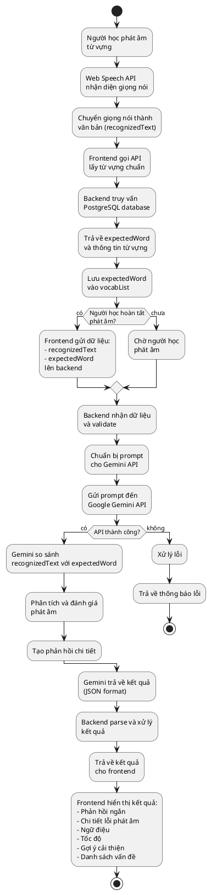
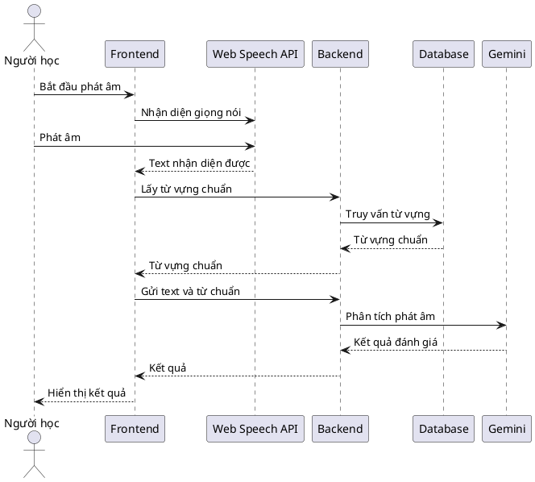

# Chấm phát âm

## Tổng quan

Chấm phát âm là một tính năng sử dụng Google Gemini API và Web Speech API để đánh giá và phân tích phát âm của người học. Hệ thống so sánh phát âm của người học với từ vựng chuẩn, cung cấp phản hồi chi tiết về độ chính xác, lỗi phát âm, ngữ điệu, tốc độ và gợi ý cải thiện.

## Cách thức hoạt động

### Quy trình tổng thể

Khi người học phát âm một từ vựng, hệ thống thực hiện các bước sau:

1. **Người học phát âm từ vựng**: Người học nói từ vựng cần luyện tập
2. **Web Speech API nhận diện giọng nói**: Trình duyệt sử dụng Web Speech API để chuyển giọng nói thành văn bản (recognizedText)
3. **Lấy từ vựng chuẩn từ database**: Hệ thống lấy từ vựng chuẩn (expectedWord) từ bảng vocabulary trong PostgreSQL thông qua API
4. **Lưu trữ trong frontend**: expectedWord được truyền vào frontend và lưu trong vocabList
5. **Gửi dữ liệu lên backend**: Frontend gửi cả recognizedText (từ Web Speech API) và expectedWord (từ database) lên backend
6. **Backend gửi prompt đến Gemini**: Backend nhận dữ liệu và gửi prompt đến Gemini API
7. **Gemini phân tích và đánh giá**: Gemini so sánh recognizedText với expectedWord, đánh giá độ chính xác phát âm
8. **Trả về kết quả đánh giá**: Gemini trả về kết quả gồm phản hồi ngắn, chi tiết lỗi phát âm, ngữ điệu, tốc độ, gợi ý cải thiện, và danh sách vấn đề cụ thể

### Chi tiết các bước

#### Bước 1: Người học phát âm từ vựng

- Người học chọn từ vựng cần luyện tập từ danh sách
- Nhấn nút "Bắt đầu phát âm" hoặc tương tự
- Người học nói từ vựng vào microphone của thiết bị

#### Bước 2: Web Speech API nhận diện giọng nói

Trình duyệt sử dụng Web Speech API (SpeechRecognition) để nhận diện giọng nói:

- **API được sử dụng**: `window.SpeechRecognition` hoặc `window.webkitSpeechRecognition`
- **Quá trình nhận diện**:
  - Microphone thu âm giọng nói của người học
  - Web Speech API xử lý tín hiệu âm thanh
  - Chuyển đổi giọng nói thành văn bản (recognizedText)
- **Kết quả**: Nhận được văn bản từ giọng nói, ví dụ: "hello" → recognizedText = "hello"

**Cấu hình Web Speech API:**
- Language: `en-US` (hoặc ngôn ngữ phù hợp)
- Continuous: `false` (chỉ nhận diện một lần)
- InterimResults: `false` (chỉ trả về kết quả cuối cùng)

#### Bước 3: Lấy từ vựng chuẩn từ database

Hệ thống lấy từ vựng chuẩn (expectedWord) từ database PostgreSQL:

- **Nguồn dữ liệu**: Bảng `vocabulary` trong PostgreSQL
- **Quá trình**:
  - Frontend gọi API để lấy thông tin từ vựng
  - Backend truy vấn database PostgreSQL
  - Trả về từ vựng chuẩn (expectedWord) cùng với các thông tin khác (nghĩa, phiên âm, ví dụ, v.v.)
- **Ví dụ**: 
  - API: `GET /api/vocab/:id`
  - Response: `{ word: "hello", meaning: "xin chào", phonetic: "/həˈloʊ/" }`
  - expectedWord = "hello"

#### Bước 4: Lưu trữ trong frontend

Từ vựng chuẩn được lưu trữ trong frontend:

- **Cấu trúc dữ liệu**: Lưu trong `vocabList` (mảng hoặc object)
- **Thông tin lưu trữ**:
  - : Từ vựng chuẩn
  - meaning: Nghĩa của từ
  - phonetic: Phiên âm
  - Các thông tin khác cần thiết
- **Mục đích**: Chuẩn bị dữ liệu để so sánh với phát âm của người học

#### Bước 5: Gửi dữ liệu lên backend

Khi người học hoàn tất phát âm, frontend gửi dữ liệu lên backend:

- **Dữ liệu gửi đi**:
  - `recognizedText`: Văn bản được nhận diện từ Web Speech API (phát âm của người học)
  - `expectedWord`: Từ vựng chuẩn từ database (đã lưu trong vocabList)
- **API endpoint**: `POST /api/pronunciation/analyze` hoặc tương tự
- **Request body**:
  ```json
  {
    "recognizedText": "hello",
    "expectedWord": "hello",
    "vocabId": 123
  }
  ```

#### Bước 6: Backend gửi prompt đến Gemini

Backend nhận dữ liệu và chuẩn bị prompt để gửi đến Gemini API:

- **Xử lý dữ liệu đầu vào**:
  - Nhận recognizedText và expectedWord từ request
  - Kiểm tra và validate dữ liệu
  - Chuẩn bị prompt cho Gemini

**Prompt được gửi đến Gemini:**
```
Phân tích và đánh giá phát âm của người học.

Từ vựng chuẩn (expectedWord): "[expectedWord]"
Phát âm của người học (recognizedText): "[recognizedText]"

Hãy so sánh và đánh giá phát âm của người học, trả về kết quả dưới dạng JSON với các thông tin sau:
1. Phản hồi ngắn: Đánh giá tổng quan về phát âm (1-2 câu)
2. Chi tiết lỗi phát âm: Mô tả các lỗi phát âm cụ thể (nếu có)
3. Ngữ điệu: Đánh giá ngữ điệu (tốt/cần cải thiện)
4. Tốc độ: Đánh giá tốc độ phát âm (phù hợp/quá nhanh/quá chậm)
5. Gợi ý cải thiện: Các gợi ý cụ thể để cải thiện phát âm
6. Danh sách vấn đề cụ thể: Mảng các vấn đề được phát hiện

Trả về JSON với format:
{
  "shortFeedback": "...",
  "pronunciationErrors": "...",
  "intonation": "...",
  "speed": "...",
  "improvementSuggestions": "...",
  "issues": ["...", "..."]
}
```

**Cấu hình API:**
- Model: `gemini-2.0-flash-exp` hoặc `gemini-pro`
- Temperature: 0.3 (để đảm bảo kết quả nhất quán)
- MaxOutputTokens: 500

#### Bước 7: Gemini phân tích và đánh giá

Gemini API nhận prompt và thực hiện phân tích:

- **So sánh recognizedText với expectedWord**:
  - Kiểm tra độ chính xác về mặt chính tả
  - Phân tích sự khác biệt về phát âm
  - Đánh giá các khía cạnh khác (ngữ điệu, tốc độ)
- **Phân tích chi tiết**:
  - Xác định các lỗi phát âm cụ thể
  - Đánh giá ngữ điệu và nhịp điệu
  - Phân tích tốc độ phát âm
  - Tạo gợi ý cải thiện dựa trên phân tích

**Ví dụ phân tích:**
- Input: expectedWord = "hello", recognizedText = "helo"
- Gemini phát hiện: Thiếu âm "l" thứ hai, phát âm chưa đầy đủ
- Kết quả: Đánh giá và đưa ra gợi ý cải thiện

#### Bước 8: Trả về kết quả đánh giá

Gemini trả về kết quả đánh giá chi tiết dưới dạng JSON:

**Cấu trúc kết quả:**
```json
{
  "shortFeedback": "Phát âm của bạn gần đúng nhưng cần cải thiện một số âm tiết.",
  "pronunciationErrors": "Bạn đã bỏ qua âm 'l' thứ hai trong từ 'hello'. Hãy chú ý phát âm đầy đủ các âm.",
  "intonation": "Ngữ điệu ổn, nhưng cần tự nhiên hơn.",
  "speed": "Tốc độ phát âm phù hợp.",
  "improvementSuggestions": "1. Luyện tập phát âm từng âm tiết một cách rõ ràng\n2. Chú ý đến âm 'l' ở giữa từ\n3. Nghe và lặp lại theo audio mẫu",
  "issues": [
    "Thiếu âm 'l' thứ hai",
    "Phát âm chưa đầy đủ",
    "Cần cải thiện độ rõ ràng"
  ]
}
```

**Xử lý kết quả:**
- Backend nhận response từ Gemini
- Parse JSON response
- Validate và xử lý dữ liệu
- Trả về cho frontend

#### Bước 9: Hiển thị kết quả cho người học

Frontend nhận kết quả và hiển thị cho người học:

- **Hiển thị phản hồi ngắn**: Hiển thị đánh giá tổng quan
- **Hiển thị chi tiết lỗi**: Liệt kê các lỗi phát âm cụ thể
- **Hiển thị đánh giá ngữ điệu và tốc độ**: Hiển thị đánh giá về ngữ điệu và tốc độ
- **Hiển thị gợi ý cải thiện**: Hiển thị các gợi ý để người học cải thiện
- **Hiển thị danh sách vấn đề**: Hiển thị danh sách các vấn đề được phát hiện

## Sơ đồ quy trình



## Sơ đồ luồng dữ liệu



## Ví dụ minh họa

### Ví dụ 1: Phát âm đúng

**Input:**
- expectedWord: "hello"
- recognizedText: "hello"

**Kết quả từ Gemini:**
```json
{
  "shortFeedback": "Phát âm của bạn rất tốt và chính xác!",
  "pronunciationErrors": "Không có lỗi phát âm đáng kể.",
  "intonation": "Ngữ điệu tự nhiên và phù hợp.",
  "speed": "Tốc độ phát âm phù hợp.",
  "improvementSuggestions": "Tiếp tục luyện tập để duy trì chất lượng phát âm.",
  "issues": []
}
```

### Ví dụ 2: Phát âm có lỗi

**Input:**
- expectedWord: "pronunciation"
- recognizedText: "pronunsiation"

**Kết quả từ Gemini:**
```json
{
  "shortFeedback": "Phát âm của bạn gần đúng nhưng có một số lỗi cần cải thiện.",
  "pronunciationErrors": "Bạn đã phát âm sai âm 'ci' thành 'si'. Từ đúng là 'pronunciation' (/prəˌnʌnsiˈeɪʃən/), không phải 'pronunsiation'.",
  "intonation": "Ngữ điệu ổn nhưng cần tự nhiên hơn.",
  "speed": "Tốc độ phát âm hơi nhanh, nên chậm lại một chút để phát âm rõ ràng hơn.",
  "improvementSuggestions": "1. Chú ý phát âm đúng âm 'ci' (/si/) trong từ 'pronunciation'\n2. Luyện tập phát âm từng âm tiết: pro-nun-ci-a-tion\n3. Nghe audio mẫu và lặp lại nhiều lần\n4. Chậm lại khi phát âm để đảm bảo độ chính xác",
  "issues": [
    "Sai âm 'ci' thành 'si'",
    "Tốc độ phát âm hơi nhanh",
    "Cần luyện tập thêm về trọng âm"
  ]
}
```

### Ví dụ 3: Phát âm thiếu âm

**Input:**
- expectedWord: "beautiful"
- recognizedText: "beautifu"

**Kết quả từ Gemini:**
```json
{
  "shortFeedback": "Bạn đã bỏ sót âm cuối trong từ, cần phát âm đầy đủ hơn.",
  "pronunciationErrors": "Bạn đã bỏ qua âm 'l' cuối cùng trong từ 'beautiful'. Từ đúng phải có đầy đủ 3 âm tiết: beau-ti-ful.",
  "intonation": "Ngữ điệu cần cải thiện, đặc biệt là trọng âm ở âm tiết đầu.",
  "speed": "Tốc độ phát âm phù hợp.",
  "improvementSuggestions": "1. Chú ý phát âm đầy đủ âm 'l' cuối cùng\n2. Luyện tập phát âm từng âm tiết: beau-ti-ful\n3. Nhấn trọng âm ở âm tiết đầu tiên\n4. Nghe và lặp lại theo audio mẫu",
  "issues": [
    "Thiếu âm 'l' cuối cùng",
    "Cần cải thiện trọng âm",
    "Phát âm chưa đầy đủ"
  ]
}
```

## Ưu điểm của hệ thống

1. **Đánh giá chính xác**: Sử dụng AI để phân tích và đánh giá phát âm một cách chi tiết và chính xác
2. **Phản hồi tức thì**: Người học nhận được phản hồi ngay sau khi phát âm
3. **Gợi ý cải thiện cụ thể**: Hệ thống cung cấp các gợi ý cải thiện rõ ràng và có thể thực hiện được
4. **Đánh giá đa chiều**: Không chỉ đánh giá độ chính xác mà còn đánh giá ngữ điệu, tốc độ
5. **Dễ sử dụng**: Chỉ cần microphone và trình duyệt, không cần cài đặt thêm phần mềm
6. **Tích hợp với database**: Tự động lấy từ vựng chuẩn từ database để so sánh

## Công nghệ sử dụng

- **Web Speech API**: API của trình duyệt để nhận diện giọng nói và chuyển đổi thành văn bản
- **Google Gemini API**: Mô hình AI để phân tích và đánh giá phát âm
- **PostgreSQL**: Database lưu trữ từ vựng chuẩn và thông tin liên quan
- **RESTful API**: Giao tiếp giữa frontend và backend
- **JSON**: Format trao đổi dữ liệu giữa các thành phần

