# CHƯƠNG III: CÁI ĐẶT THỰC NGHIỆM, KẾT QUẢ VÀ ĐÁNH GIÁ

## 3.1. Sơ đồ usecase

### 3.1.1. Usecase Đăng nhập

Sơ đồ usecase Đăng nhập mô tả quá trình người dùng (cả Học viên và Quản trị viên) truy cập vào hệ thống VocaType bằng cách nhập email và mật khẩu, hệ thống sẽ xác thực thông tin đăng nhập và cấp quyền truy cập tương ứng với vai trò của người dùng, nếu thông tin đúng thì chuyển đến trang chủ tương ứng, nếu sai thì hiển thị thông báo lỗi và yêu cầu nhập lại.

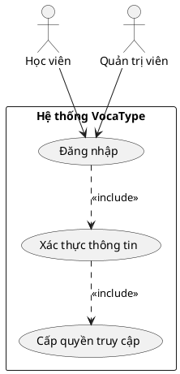

### 3.1.2. Usecase Đăng ký tài khoản

Sơ đồ usecase Đăng ký tài khoản mô tả quá trình người dùng mới tạo tài khoản Học viên trên hệ thống bằng cách điền thông tin cá nhân gồm họ tên, email và mật khẩu, hệ thống kiểm tra email đã tồn tại chưa, nếu chưa thì gửi email xác nhận đến địa chỉ email đã đăng ký, người dùng nhấn vào link xác nhận trong email để kích hoạt tài khoản, sau đó có thể đăng nhập và sử dụng hệ thống.

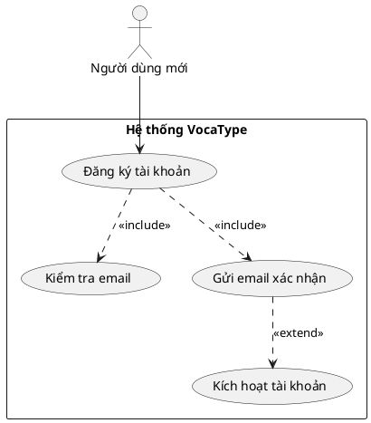

### 3.1.3. Usecase Học từ vựng mới

Sơ đồ usecase Học từ vựng mới mô tả quá trình Học viên chọn chủ đề và chương cụ thể để học từ vựng mới, hệ thống hiển thị từng từ vựng kèm theo nghĩa, phiên âm, câu ví dụ và phát âm, Học viên xem và nghe từng từ rồi đánh dấu nhớ hoặc quên, sau khi học xong tất cả từ thì chuyển sang giai đoạn luyện tập với các bài tập nghe chọn từ, điền từ vào chỗ trống, chọn nghĩa đúng, tiếp theo là giai đoạn áp dụng với bài tập điền từ vào câu ví dụ, cuối cùng hệ thống tính điểm, lưu tiến độ học tập và cập nhật điểm kinh nghiệm cho Học viên.

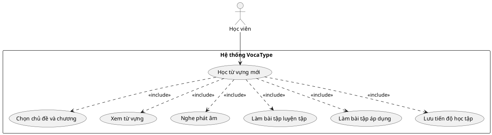

### 3.1.4. Usecase Ôn tập Flashcard

Sơ đồ usecase Ôn tập Flashcard mô tả quá trình Học viên sử dụng thẻ flashcard để ôn tập từ vựng đã học trước đó, Học viên chọn danh sách flashcard theo chủ đề hoặc từ đã học, hệ thống hiển thị mặt trước của thẻ với từ vựng, Học viên suy nghĩ về nghĩa rồi lật thẻ để xem mặt sau với nghĩa và câu ví dụ, sau đó đánh dấu từ đã nhớ hoặc cần ôn lại, chuyển sang thẻ tiếp theo cho đến hết danh sách, cuối cùng hệ thống hiển thị thống kê số từ đã nhớ và cần ôn lại.

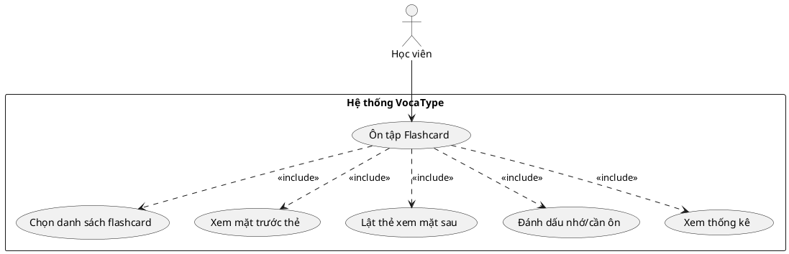

### 3.1.5. Usecase Luyện Dictation

Sơ đồ usecase Luyện Dictation mô tả quá trình Học viên luyện kỹ năng nghe và chép chính tả tiếng Anh, Học viên chọn chủ đề Dictation muốn luyện tập, hệ thống phát âm thanh từng câu tiếng Anh, Học viên nghe và gõ lại câu đã nghe vào ô nhập liệu, sau đó nộp câu trả lời, hệ thống so sánh câu trả lời với đáp án đúng để chấm điểm tự động, tính toán độ chính xác và hiển thị kết quả điểm số cùng phản hồi về lỗi sai, Học viên xem kết quả và chuyển sang câu tiếp theo, sau khi hoàn thành tất cả câu thì hệ thống hiển thị kết quả tổng, lưu lịch sử Dictation và cập nhật điểm kinh nghiệm.

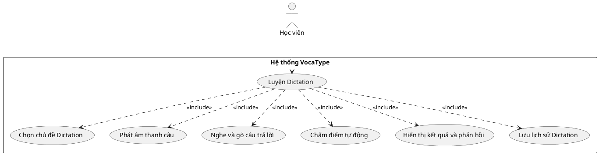

### 3.1.6. Usecase Xem lộ trình học

Sơ đồ usecase Xem lộ trình học mô tả quá trình Học viên xem lộ trình học tập cá nhân với cây kỹ năng (Skill Tree) thể hiện tiến độ các kỹ năng Nghe, Đọc, Viết, hệ thống hiển thị phần trăm hoàn thành của từng kỹ năng dựa trên các hoạt động đã thực hiện như học từ vựng, luyện Dictation, làm bài thi Reading, hệ thống phân tích điểm mạnh và điểm yếu của Học viên, đưa ra gợi ý học tập phù hợp như nên tập trung vào kỹ năng nào, nên học chủ đề gì tiếp theo, đồng thời hiển thị các huy hiệu đã đạt được, điểm kinh nghiệm (EXP), cấp độ (Level) và chuỗi ngày học liên tục (Streak).

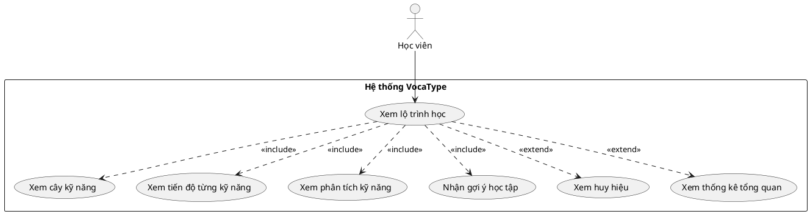

### 3.1.7. Usecase Làm bài thi (Ngân hàng đề)

Sơ đồ usecase Làm bài thi từ Ngân hàng đề mô tả quá trình Học viên luyện tập kỹ năng Reading bằng cách làm các đề thi có sẵn, Học viên truy cập trang Ngân hàng đề và xem danh sách đề thi được phân loại theo độ khó và chủ đề, chọn đề thi muốn làm, hệ thống hiển thị đoạn văn đầu tiên và bắt đầu đếm thời gian, Học viên đọc đoạn văn và trả lời các câu hỏi trắc nghiệm bằng cách chọn đáp án A, B, C hoặc D, có thể quay lại đọc đoạn văn hoặc đổi đáp án bất kỳ lúc nào, sau khi hoàn thành tất cả câu hỏi thì nộp bài, hệ thống dừng đếm thời gian, chấm điểm tự động, tính số câu đúng và sai, hiển thị kết quả chi tiết kèm đáp án đúng và giải thích, lưu kết quả vào cơ sở dữ liệu và cập nhật điểm kinh nghiệm cho Học viên.

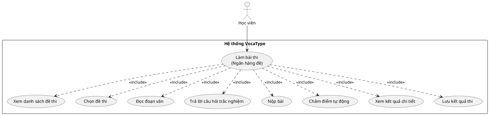

---

## 3.2. Sơ đồ trạng thái

### 3.2.1. Trạng thái Đăng nhập

Sơ đồ trạng thái Đăng nhập mô tả các trạng thái của hệ thống khi người dùng thực hiện đăng nhập, bắt đầu từ trạng thái Chưa đăng nhập, người dùng nhập email và mật khẩu chuyển sang trạng thái Đang xác thực, hệ thống kiểm tra thông tin, nếu đúng thì chuyển sang trạng thái Đã đăng nhập và người dùng có thể sử dụng hệ thống, nếu sai thì quay lại trạng thái Chưa đăng nhập và hiển thị thông báo lỗi.

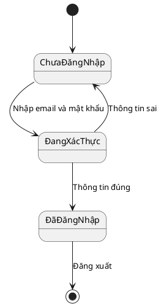

### 3.2.2. Trạng thái Đăng ký tài khoản

Sơ đồ trạng thái Đăng ký tài khoản mô tả các trạng thái khi người dùng mới tạo tài khoản, bắt đầu từ trạng thái Chưa có tài khoản, người dùng điền thông tin chuyển sang trạng thái Đang kiểm tra email, nếu email đã tồn tại thì quay lại trạng thái Chưa có tài khoản với thông báo lỗi, nếu email hợp lệ thì chuyển sang trạng thái Chờ xác nhận email, người dùng nhấn link xác nhận trong email chuyển sang trạng thái Tài khoản đã kích hoạt và có thể đăng nhập sử dụng.

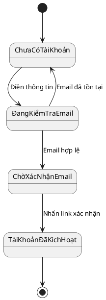

### 3.2.3. Trạng thái Học từ vựng mới

Sơ đồ trạng thái Học từ vựng mới mô tả các giai đoạn học từ vựng, bắt đầu từ trạng thái Chọn chủ đề, sau khi chọn xong chuyển sang trạng thái Học từ mới để xem từ vựng, nghĩa, ví dụ và nghe phát âm, hoàn thành học từ chuyển sang trạng thái Luyện tập với các bài tập nghe chọn từ, điền từ, chọn nghĩa, hoàn thành luyện tập chuyển sang trạng thái Áp dụng để điền từ vào câu ví dụ, cuối cùng chuyển sang trạng thái Kết quả để xem điểm số và nhận điểm kinh nghiệm.

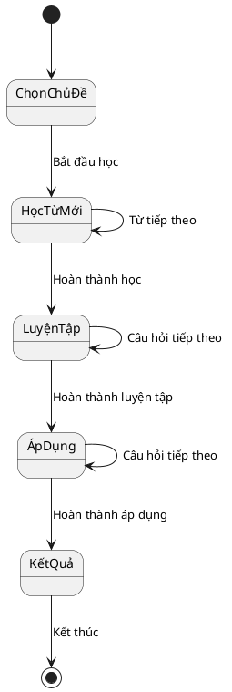

### 3.2.4. Trạng thái Ôn tập Flashcard

Sơ đồ trạng thái Ôn tập Flashcard mô tả quá trình ôn tập từ vựng bằng thẻ flashcard, bắt đầu từ trạng thái Chọn danh sách flashcard, sau đó chuyển sang trạng thái Xem mặt trước thẻ với từ vựng, người dùng lật thẻ chuyển sang trạng thái Xem mặt sau thẻ với nghĩa và ví dụ, sau đó đánh dấu nhớ hoặc cần ôn chuyển sang trạng thái Chuyển thẻ tiếp theo, nếu còn thẻ thì quay lại trạng thái Xem mặt trước thẻ, nếu hết thẻ thì chuyển sang trạng thái Xem thống kê và kết thúc.

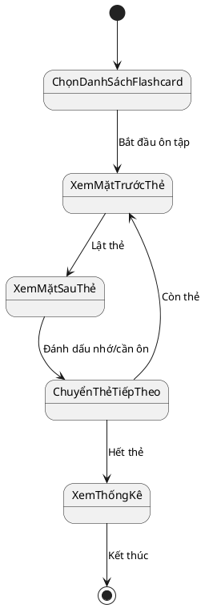

### 3.2.5. Trạng thái Luyện Dictation

Sơ đồ trạng thái Luyện Dictation mô tả quá trình luyện nghe và chép chính tả, bắt đầu từ trạng thái Chọn chủ đề Dictation, sau đó chuyển sang trạng thái Phát âm thanh câu, người dùng nghe và gõ câu trả lời chuyển sang trạng thái Đang gõ câu trả lời, nộp câu trả lời chuyển sang trạng thái Đang chấm điểm tự động, hệ thống so sánh câu trả lời với đáp án đúng và tính điểm, sau đó chuyển sang trạng thái Hiển thị kết quả và phản hồi, nếu còn câu thì quay lại trạng thái Phát âm thanh câu, nếu hết câu thì chuyển sang trạng thái Xem kết quả tổng và kết thúc.

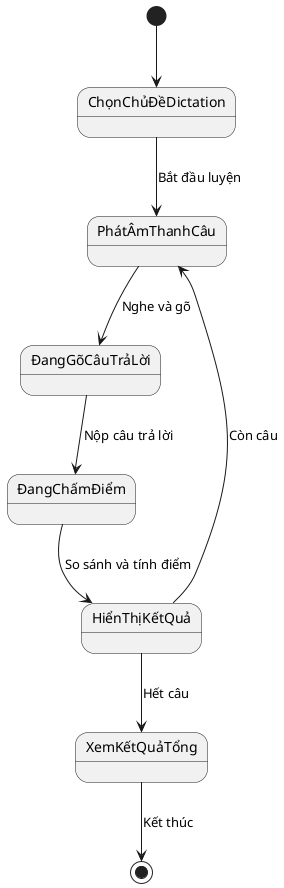

### 3.2.6. Trạng thái Xem lộ trình học

Sơ đồ trạng thái Xem lộ trình học mô tả quá trình xem lộ trình học tập cá nhân, bắt đầu từ trạng thái Truy cập trang lộ trình, hệ thống tải dữ liệu chuyển sang trạng thái Đang tải dữ liệu, sau khi tải xong chuyển sang trạng thái Hiển thị cây kỹ năng với tiến độ các kỹ năng Nghe, Đọc, Viết, người dùng có thể chuyển sang trạng thái Xem phân tích kỹ năng để xem điểm mạnh điểm yếu, hoặc chuyển sang trạng thái Xem huy hiệu để xem các huy hiệu đã đạt được, hoặc chuyển sang trạng thái Xem thống kê tổng quan để xem EXP, Level, Streak, cuối cùng kết thúc.

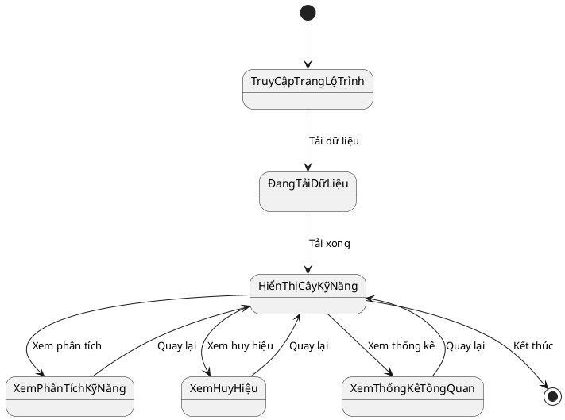

### 3.2.7. Trạng thái Làm bài thi (Ngân hàng đề)

Sơ đồ trạng thái Làm bài thi từ Ngân hàng đề mô tả quá trình làm bài thi Reading, bắt đầu từ trạng thái Xem danh sách đề thi, chọn đề thi chuyển sang trạng thái Đọc đoạn văn, đọc xong chuyển sang trạng thái Trả lời câu hỏi để chọn đáp án A, B, C hoặc D, có thể quay lại trạng thái Đọc đoạn văn bất kỳ lúc nào, sau khi trả lời hết câu hỏi chuyển sang trạng thái Xác nhận nộp bài, nếu chắc chắn thì chuyển sang trạng thái Đang chấm điểm, nếu chưa chắc thì quay lại trạng thái Trả lời câu hỏi, sau khi chấm điểm xong chuyển sang trạng thái Xem kết quả chi tiết với điểm số, đáp án đúng sai và giải thích, cuối cùng kết thúc.

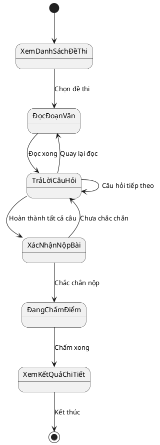

---

## 3.3. Sơ đồ tuần tự

### 3.3.1. Tuần tự Đăng nhập

Sơ đồ tuần tự Đăng nhập mô tả trình tự tương tác giữa Người dùng, Trang đăng nhập, Máy chủ ứng dụng và Cơ sở dữ liệu khi người dùng thực hiện đăng nhập vào hệ thống, người dùng nhập email và mật khẩu vào form đăng nhập, trang web gửi thông tin đến máy chủ, máy chủ truy vấn cơ sở dữ liệu để kiểm tra thông tin đăng nhập, nếu đúng thì tạo phiên đăng nhập và trả về token xác thực, trang web lưu token và chuyển hướng người dùng đến trang chủ tương ứng với vai trò của họ.

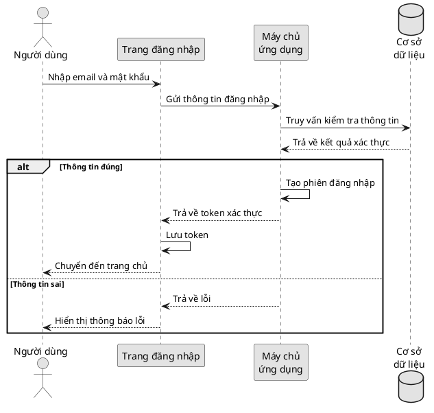

### 3.3.2. Tuần tự Đăng ký tài khoản

Sơ đồ tuần tự Đăng ký tài khoản mô tả quá trình người dùng mới tạo tài khoản trên hệ thống, người dùng điền thông tin họ tên, email và mật khẩu vào form đăng ký, trang web gửi thông tin đến máy chủ, máy chủ kiểm tra email đã tồn tại chưa bằng cách truy vấn cơ sở dữ liệu, nếu email chưa tồn tại thì tạo tài khoản mới và gửi email xác nhận đến địa chỉ email đã đăng ký, người dùng nhấn vào link xác nhận trong email, hệ thống kích hoạt tài khoản và cho phép người dùng đăng nhập.

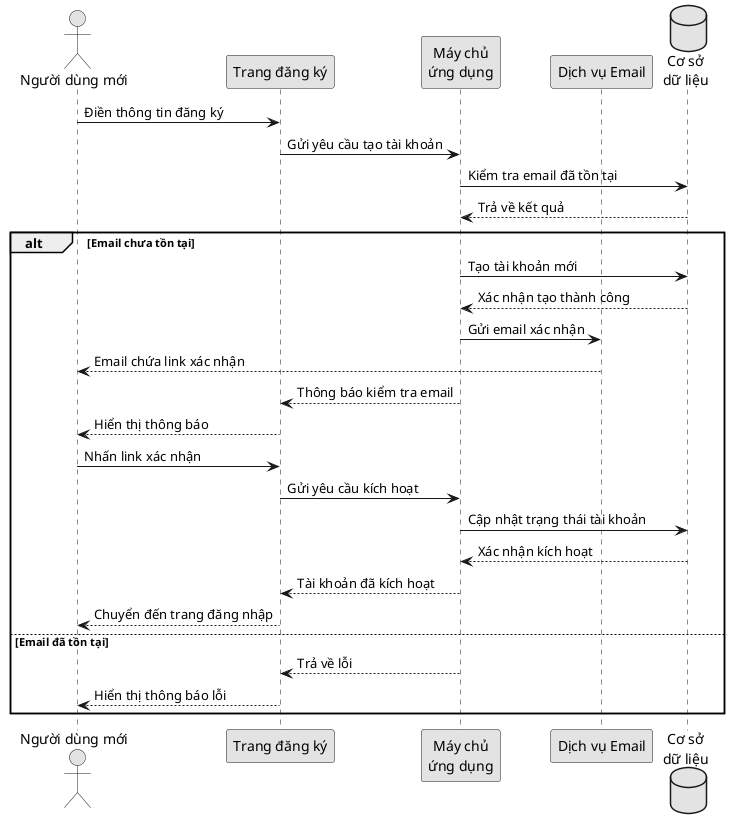

### 3.3.3. Tuần tự Học từ vựng mới

Sơ đồ tuần tự Học từ vựng mới mô tả quá trình học viên học từ vựng mới, học viên chọn chủ đề và chương muốn học, trang web gửi yêu cầu đến máy chủ, máy chủ truy vấn cơ sở dữ liệu để lấy danh sách từ vựng theo chủ đề và chương đã chọn, cơ sở dữ liệu trả về danh sách từ vựng, máy chủ gửi dữ liệu đến trang web, trang web hiển thị từng từ vựng kèm nghĩa, phiên âm, ví dụ và phát âm, học viên xem và nghe từng từ rồi đánh dấu nhớ hoặc quên, sau khi hoàn thành bài học, trang web gửi kết quả học tập đến máy chủ, máy chủ lưu tiến độ học tập và cập nhật điểm kinh nghiệm vào cơ sở dữ liệu, cuối cùng hiển thị thành tích cho học viên.

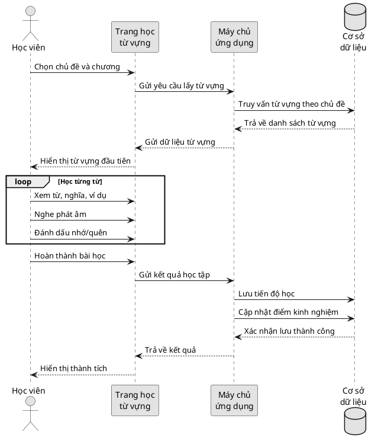

### 3.3.4. Tuần tự Ôn tập Flashcard

Sơ đồ tuần tự Ôn tập Flashcard mô tả quá trình học viên ôn tập từ vựng bằng thẻ flashcard, học viên chọn danh sách flashcard muốn ôn tập (theo chủ đề hoặc từ đã học), trang web gửi yêu cầu đến máy chủ, máy chủ truy vấn cơ sở dữ liệu để lấy danh sách từ vựng cần ôn tập, cơ sở dữ liệu trả về danh sách, máy chủ gửi dữ liệu đến trang web, trang web hiển thị mặt trước của thẻ flashcard với từ vựng, học viên suy nghĩ về nghĩa rồi lật thẻ để xem mặt sau với nghĩa và ví dụ, sau đó đánh dấu đã nhớ hoặc cần ôn lại, lặp lại cho tất cả thẻ, cuối cùng trang web gửi kết quả ôn tập đến máy chủ, máy chủ cập nhật trạng thái từ vựng và hiển thị thống kê cho học viên.

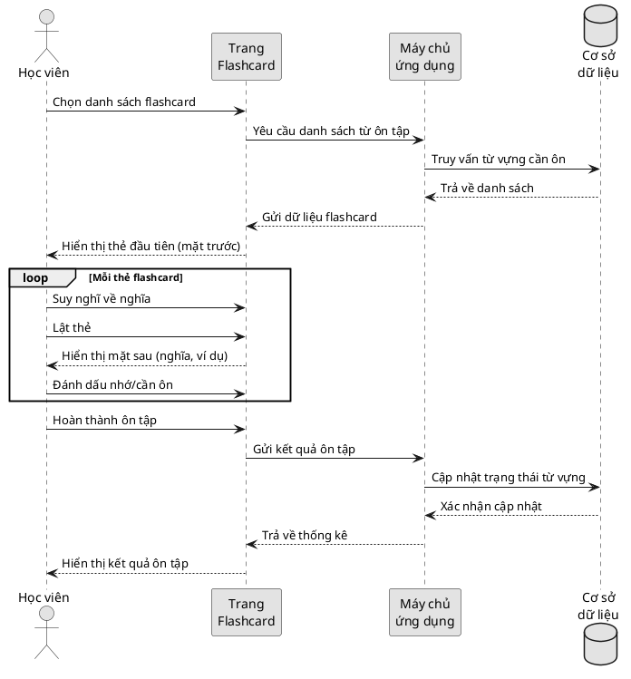

### 3.3.5. Tuần tự Luyện Dictation

Sơ đồ tuần tự Luyện Dictation mô tả quá trình học viên luyện nghe và chép chính tả với chấm điểm tự động, học viên chọn chủ đề Dictation muốn luyện tập, trang web gửi yêu cầu đến máy chủ, máy chủ truy vấn cơ sở dữ liệu để lấy danh sách câu Dictation, cơ sở dữ liệu trả về danh sách câu, máy chủ gửi dữ liệu đến trang web, trang web phát âm thanh từng câu, học viên nghe và gõ câu trả lời vào ô nhập liệu, sau đó nộp câu trả lời, trang web gửi câu trả lời đến máy chủ, máy chủ so sánh câu trả lời với đáp án đúng để tính điểm, gửi kết quả về trang web, trang web hiển thị điểm số và phản hồi cho học viên, lặp lại cho tất cả câu, sau khi hoàn thành, máy chủ lưu lịch sử Dictation và cập nhật điểm kinh nghiệm, cuối cùng hiển thị kết quả tổng cho học viên.

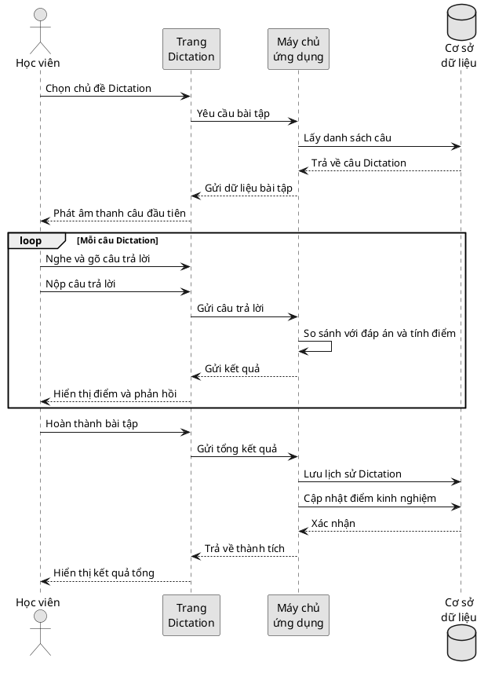

### 3.3.6. Tuần tự Xem lộ trình học

Sơ đồ tuần tự Xem lộ trình học mô tả quá trình học viên xem lộ trình học tập cá nhân, học viên truy cập trang lộ trình học, trang web gửi yêu cầu đến máy chủ để lấy dữ liệu thống kê học tập, máy chủ truy vấn cơ sở dữ liệu để lấy thông tin về tiến độ học tập, số từ đã học, số bài Dictation đã làm, số bài thi Reading đã hoàn thành, điểm kinh nghiệm, cấp độ và các huy hiệu đã đạt được, cơ sở dữ liệu trả về tất cả dữ liệu, máy chủ tính toán phần trăm hoàn thành của từng kỹ năng (Nghe, Đọc, Viết), phân tích điểm mạnh điểm yếu và đưa ra gợi ý học tập, gửi dữ liệu đến trang web, trang web hiển thị cây kỹ năng, phân tích kỹ năng, huy hiệu và thống kê tổng quan cho học viên.

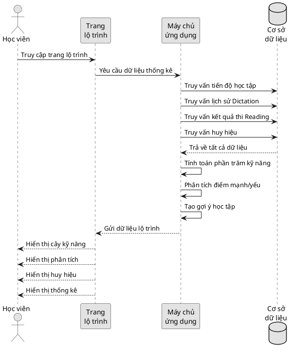

### 3.3.7. Tuần tự Làm bài thi (Ngân hàng đề)

Sơ đồ tuần tự Làm bài thi từ Ngân hàng đề mô tả quá trình học viên làm bài thi Reading, học viên truy cập trang Ngân hàng đề, trang web gửi yêu cầu đến máy chủ, máy chủ truy vấn cơ sở dữ liệu để lấy danh sách đề thi, cơ sở dữ liệu trả về danh sách, trang web hiển thị danh sách đề thi cho học viên chọn, học viên chọn đề thi muốn làm, máy chủ lấy nội dung đề thi từ cơ sở dữ liệu bao gồm đoạn văn và câu hỏi, gửi đến trang web, trang web hiển thị đoạn văn và câu hỏi, bắt đầu đếm thời gian, học viên đọc đoạn văn và trả lời câu hỏi trắc nghiệm, sau khi hoàn thành tất cả câu hỏi, học viên nộp bài, trang web gửi đáp án đến máy chủ, máy chủ chấm điểm tự động bằng cách so sánh đáp án, tính số câu đúng và điểm tổng, lưu kết quả vào cơ sở dữ liệu, cập nhật điểm kinh nghiệm, gửi kết quả chi tiết về trang web, trang web hiển thị điểm số, đáp án đúng sai và giải thích cho học viên.

```plantuml
@startuml
skinparam monochrome true

actor "Học viên" as hv
participant "Trang\nNgân hàng đề" as page
participant "Máy chủ\nứng dụng" as server
database "Cơ sở\ndữ liệu" as db

hv -> page : Truy cập Ngân hàng đề
page -> server : Yêu cầu danh sách đề thi
server -> db : Truy vấn đề thi
db --> server : Trả về danh sách
server --> page : Gửi danh sách đề
page --> hv : Hiển thị danh sách đề thi

hv -> page : Chọn đề thi
page -> server : Yêu cầu nội dung đề thi
server -> db : Lấy đoạn văn và câu hỏi
db --> server : Trả về nội dung đề thi
server --> page : Gửi dữ liệu đề thi
page --> hv : Hiển thị đề thi
page -> page : Bắt đầu đếm thời gian

loop Mỗi câu hỏi
  hv -> page : Đọc đoạn văn
  hv -> page : Chọn đáp án
end

hv -> page : Nộp bài
page -> page : Dừng đếm thời gian
page -> server : Gửi đáp án
server -> server : Chấm điểm tự động
server -> server : Tính số câu đúng/sai
server -> db : Lưu kết quả thi
server -> db : Cập nhật điểm kinh nghiệm
db --> server : Xác nhận lưu
server --> page : Gửi kết quả chi tiết
page --> hv : Hiển thị điểm số
page --> hv : Hiển thị đáp án đúng/sai
page --> hv : Hiển thị giải thích

@enduml
```

---

## 3.4. Sơ đồ hoạt động

### 3.4.1. Hoạt động Đăng nhập

Sơ đồ hoạt động Đăng nhập mô tả luồng công việc khi người dùng thực hiện đăng nhập vào hệ thống, bắt đầu từ việc truy cập trang đăng nhập, nhập email và mật khẩu, hệ thống kiểm tra thông tin đăng nhập, nếu thông tin đúng thì tạo phiên đăng nhập và chuyển đến trang chủ tương ứng với vai trò (Học viên hoặc Quản trị viên), nếu thông tin sai thì hiển thị thông báo lỗi và cho phép người dùng nhập lại hoặc chọn quên mật khẩu để khôi phục.

```plantuml
@startuml
skinparam monochrome true

start

:Truy cập trang đăng nhập;
:Nhập email và mật khẩu;
:Nhấn nút Đăng nhập;

:Hệ thống kiểm tra thông tin;

if (Thông tin đúng?) then (Có)
  :Tạo phiên đăng nhập;
  :Lưu token xác thực;
  
  if (Vai trò?) then (Học viên)
    :Chuyển đến trang chủ Học viên;
  else (Quản trị viên)
    :Chuyển đến trang quản trị;
  endif
  
  stop
else (Không)
  :Hiển thị thông báo lỗi;
  
  if (Muốn thử lại?) then (Có)
    :Quay lại nhập thông tin;
  else (Quên mật khẩu)
    :Chuyển đến trang khôi phục mật khẩu;
    stop
  endif
endif

@enduml
```

### 3.4.2. Hoạt động Đăng ký tài khoản

Sơ đồ hoạt động Đăng ký tài khoản mô tả quy trình tạo tài khoản mới, bắt đầu từ việc truy cập trang đăng ký, điền thông tin họ tên, email và mật khẩu, hệ thống kiểm tra email đã tồn tại chưa, nếu email chưa tồn tại thì tạo tài khoản mới và gửi email xác nhận, người dùng kiểm tra email và nhấn vào link xác nhận, hệ thống kích hoạt tài khoản và chuyển đến trang đăng nhập, nếu email đã tồn tại thì hiển thị thông báo lỗi và yêu cầu nhập email khác.

```plantuml
@startuml
skinparam monochrome true

start

:Truy cập trang đăng ký;
:Điền thông tin (họ tên, email, mật khẩu);
:Nhấn nút Đăng ký;

:Hệ thống kiểm tra email;

if (Email đã tồn tại?) then (Có)
  :Hiển thị thông báo lỗi;
  :Yêu cầu nhập email khác;
  stop
else (Không)
  :Tạo tài khoản mới;
  :Gửi email xác nhận;
  :Hiển thị thông báo kiểm tra email;
  
  :Người dùng mở email;
  :Nhấn vào link xác nhận;
  
  :Hệ thống kích hoạt tài khoản;
  :Hiển thị thông báo thành công;
  :Chuyển đến trang đăng nhập;
  
  stop
endif

@enduml
```

### 3.4.3. Hoạt động Học từ vựng mới

Sơ đồ hoạt động Học từ vựng mới mô tả quy trình học từ vựng với 3 giai đoạn chính, bắt đầu từ việc chọn chủ đề và chương, sau đó vào giai đoạn học để xem từ vựng, nghĩa, ví dụ và nghe phát âm, đánh dấu nhớ hoặc quên từng từ, tiếp theo là giai đoạn luyện tập với các loại câu hỏi khác nhau, hệ thống kiểm tra đáp án và cộng điểm nếu đúng, sau đó là giai đoạn áp dụng để điền từ vào câu ví dụ, cuối cùng tính tổng điểm, lưu tiến độ học tập, cập nhật điểm kinh nghiệm và hiển thị kết quả.

```plantuml
@startuml
skinparam monochrome true

start

:Chọn chủ đề và chương;

:Giai đoạn học
Xem từ vựng, nghĩa, ví dụ
Nghe phát âm, đánh dấu nhớ/quên;

:Giai đoạn luyện tập
Trả lời câu hỏi (Nghe/Điền từ/Chọn nghĩa)
Kiểm tra đáp án và cộng điểm;

:Giai đoạn áp dụng
Điền từ vào câu ví dụ
Kiểm tra và hiển thị gợi ý nếu sai;

:Tính tổng điểm và lưu tiến độ;
:Cập nhật điểm kinh nghiệm;
:Hiển thị kết quả;

stop

@enduml
```

### 3.4.4. Hoạt động Ôn tập Flashcard

Sơ đồ hoạt động Ôn tập Flashcard mô tả quy trình ôn tập từ vựng bằng thẻ flashcard, bắt đầu từ việc chọn danh sách flashcard muốn ôn tập theo chủ đề hoặc từ đã học, hệ thống hiển thị mặt trước của thẻ với từ vựng, học viên suy nghĩ về nghĩa rồi lật thẻ để xem mặt sau với nghĩa và ví dụ, sau đó đánh dấu đã nhớ hoặc cần ôn lại, lặp lại cho tất cả thẻ trong danh sách, cuối cùng hệ thống cập nhật trạng thái từ vựng và hiển thị thống kê kết quả ôn tập.

```plantuml
@startuml
skinparam monochrome true

start

:Chọn danh sách flashcard;
:Hệ thống tải danh sách từ vựng;

:Hiển thị thẻ đầu tiên (mặt trước);

repeat
  :Xem từ vựng trên mặt trước;
  :Suy nghĩ về nghĩa;
  
  :Nhấn nút Lật thẻ;
  :Hiển thị mặt sau (nghĩa, ví dụ);
  
  if (Đã nhớ từ này?) then (Có)
    :Đánh dấu "Đã nhớ";
  else (Không)
    :Đánh dấu "Cần ôn lại";
  endif
  
  :Chuyển sang thẻ tiếp theo;
  
repeat while (Còn thẻ?) is (Có)
->Không;

:Tính số thẻ đã nhớ/cần ôn;
:Cập nhật trạng thái từ vựng;
:Hiển thị thống kê kết quả;

stop

@enduml
```

### 3.4.5. Hoạt động Luyện Dictation

Sơ đồ hoạt động Luyện Dictation mô tả quy trình luyện nghe và chép chính tả, bắt đầu từ việc chọn chủ đề Dictation muốn luyện tập, hệ thống phát âm thanh từng câu tiếng Anh, học viên nghe và gõ lại câu đã nghe vào ô nhập liệu, sau đó nộp câu trả lời, hệ thống so sánh câu trả lời với đáp án đúng để tính điểm, hiển thị kết quả điểm số và phản hồi về lỗi sai, học viên xem kết quả và chuyển sang câu tiếp theo, lặp lại cho tất cả câu, sau khi hoàn thành, hệ thống tính điểm trung bình, lưu lịch sử Dictation, cập nhật điểm kinh nghiệm và hiển thị kết quả tổng.

```plantuml
@startuml
skinparam monochrome true

start

:Chọn chủ đề Dictation;
:Hệ thống tải danh sách câu;

:Phát âm thanh câu đầu tiên;

repeat
  :Nghe câu tiếng Anh;
  :Gõ câu trả lời vào ô nhập liệu;
  
  if (Muốn nghe lại?) then (Có)
    :Phát lại âm thanh;
  else (Không)
  endif
  
  :Nhấn nút Nộp câu trả lời;
  
  :Hệ thống so sánh với đáp án;
  :Tính điểm cho câu này;
  
  :Hiển thị kết quả;
  :Hiển thị phản hồi về lỗi sai;
  
  if (Điểm >= 80?) then (Có)
    :Hiển thị thông báo "Tốt lắm";
  else (Không)
    :Hiển thị đáp án đúng;
  endif
  
  :Chuyển sang câu tiếp theo;
  
repeat while (Còn câu?) is (Có)
->Không;

:Tính điểm trung bình;
:Lưu lịch sử Dictation;
:Cập nhật điểm kinh nghiệm;
:Hiển thị kết quả tổng;

stop

@enduml
```

### 3.4.6. Hoạt động Xem lộ trình học

Sơ đồ hoạt động Xem lộ trình học mô tả quy trình xem lộ trình học tập cá nhân, bắt đầu từ việc truy cập trang lộ trình học, hệ thống tải dữ liệu thống kê học tập từ cơ sở dữ liệu bao gồm tiến độ học từ vựng, lịch sử Dictation, kết quả thi Reading, điểm kinh nghiệm, cấp độ và huy hiệu, sau đó tính toán phần trăm hoàn thành của từng kỹ năng Nghe, Đọc, Viết, phân tích điểm mạnh điểm yếu và đưa ra gợi ý học tập, cuối cùng hiển thị cây kỹ năng với các nhánh và mức độ mở khóa, phân tích kỹ năng, danh sách huy hiệu đã đạt được và thống kê tổng quan.

```plantuml
@startuml
skinparam monochrome true

start

:Truy cập trang lộ trình học;
:Hệ thống tải dữ liệu thống kê;

:Tính toán phần trăm kỹ năng;
:Phân tích điểm mạnh/yếu;
:Tạo gợi ý học tập;

:Hiển thị cây kỹ năng;

partition "Xem chi tiết" {
  if (Chọn xem gì?) then (Phân tích kỹ năng)
    :Hiển thị biểu đồ kỹ năng;
    :Hiển thị điểm mạnh/yếu;
    :Hiển thị gợi ý cải thiện;
  elseif (Huy hiệu) then
    :Hiển thị danh sách huy hiệu;
    :Hiển thị tiến độ đạt huy hiệu;
  elseif (Thống kê) then
    :Hiển thị EXP và Level;
    :Hiển thị Streak;
    :Hiển thị số ngày học;
  else (Cây kỹ năng)
    :Hiển thị các nhánh kỹ năng;
    :Hiển thị trạng thái mở khóa;
  endif
}

stop

@enduml
```

### 3.4.7. Hoạt động Làm bài thi (Ngân hàng đề)

Sơ đồ hoạt động Làm bài thi từ Ngân hàng đề mô tả quy trình làm bài thi Reading, bắt đầu từ việc vào trang Ngân hàng đề và chọn đề thi muốn làm, hệ thống hiển thị đoạn văn và bắt đầu đếm thời gian, học viên đọc đoạn văn và trả lời câu hỏi trắc nghiệm, sau khi hoàn thành, học viên xác nhận nộp bài, nếu chắc chắn thì hệ thống dừng đếm thời gian, chấm điểm tự động, lưu kết quả và hiển thị kết quả chi tiết kèm đáp án đúng và giải thích.

```plantuml
@startuml
skinparam monochrome true

start

:Vào trang Ngân hàng đề;
:Chọn đề thi Reading;
:Bắt đầu đếm thời gian;

:Đọc đoạn văn và trả lời câu hỏi
Chọn đáp án A, B, C hoặc D
(Có thể đổi đáp án);

:Xác nhận nộp bài;

if (Chắc chắn nộp?) then (Có)
  :Dừng đếm thời gian;
  :Chấm điểm tự động;
  :Lưu kết quả và cập nhật EXP;
  :Hiển thị kết quả chi tiết;
  stop
else (Không)
  :Quay lại làm bài;
  stop
endif

@enduml
```

---

## 3.5. Sơ đồ class

### Mô tả chung

Sơ đồ class mô tả cấu trúc tĩnh của hệ thống VocaType, bao gồm các lớp chính và mối quan hệ giữa chúng. Hệ thống có lớp NguoiDung làm lớp cha cho HocVien và QuanTriVien, các lớp quản lý nội dung gồm ChuDe, Chuong, TuVung, các lớp theo dõi tiến độ gồm TienDoHocTap, LichSuDictation, KetQuaThi, các lớp bài tập gồm BaiTapDictation, DeThi, CauHoi, và các lớp gamification gồm HuyHieu, HocVienHuyHieu với các mối quan hệ kế thừa và liên kết 1-nhiều.

```plantuml
@startuml
skinparam monochrome true
skinparam classAttributeIconSize 0
skinparam linetype ortho

class NguoiDung {
  - id, email, matKhau
  - hoTen, vaiTro
  + dangNhap()
  + dangXuat()
}

class HocVien {
  - diemKinhNghiem
  - capDo, chuoiNgayHoc
  + hocTuVung()
  + luyenDictation()
  + lamBaiThi()
}

class QuanTriVien {
  + quanLyNguoiDung()
  + quanLyNoiDung()
}

class ChuDe {
  - id, tenChuDe
  - moTa, anhBia
}

class Chuong {
  - id, tenChuong
  - thuTu
}

class TuVung {
  - id, tu, nghia
  - phienAm, viDu
  - linkAmThanh
}

class TienDoHocTap {
  - id, daNho
  - gianDoan, ngayHoc
}

class BaiTapDictation {
  - id, tenBaiTap
  - danhSachCau
}

class LichSuDictation {
  - id, soCau
  - diemTrungBinh
  - ngayLam
}

class DeThi {
  - id, tenDe
  - doKho, thoiGian
}

class CauHoi {
  - id, noiDung
  - dapAnA, B, C, D
  - dapAnDung
}

class KetQuaThi {
  - id, soCauDung
  - tongSoCau, diem
  - ngayLam
}

class HuyHieu {
  - id, tenHuyHieu
  - moTa, anhBieu
  - dieuKien
}

class HocVienHuyHieu {
  - hocVienId
  - huyHieuId
  - ngayDatDuoc
}

NguoiDung <|-- HocVien
NguoiDung <|-- QuanTriVien

ChuDe "1" -- "*" Chuong
Chuong "1" -- "*" TuVung
HocVien "1" -- "*" TienDoHocTap
TuVung "1" -- "*" TienDoHocTap

HocVien "1" -- "*" LichSuDictation
BaiTapDictation "1" -- "*" LichSuDictation

HocVien "1" -- "*" KetQuaThi
DeThi "1" -- "*" KetQuaThi
DeThi "1" -- "*" CauHoi

HocVien "1" -- "*" HocVienHuyHieu
HuyHieu "1" -- "*" HocVienHuyHieu

@enduml
```

---

**Ghi chú:**
- Tất cả các sơ đồ đều sử dụng tiếng Việt
- Không sử dụng thuật ngữ tiếng Anh hay "học máy"
- Sơ đồ đơn giản, dễ hiểu, thể hiện đủ nội dung chính
- Có thể render bằng PlantUML online hoặc extension trong IDE
