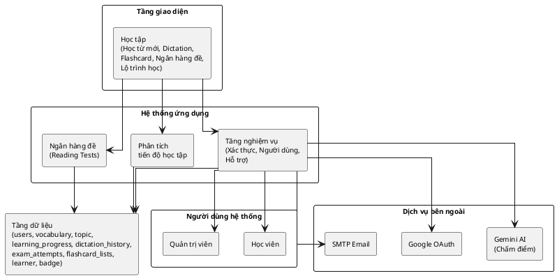

# 2.2. Thiết kế tổng thể hệ thống

## 2.2.1. Tổng quan kiến trúc

VocaType được xây dựng theo mô hình Client-Server với kiến trúc phân tầng (Layered Architecture), bao gồm 4 thành phần chính là Tầng giao diện (Frontend Layer), Hệ thống ứng dụng (Backend Layer), Tầng dữ liệu (Database Layer) và Dịch vụ bên ngoài (External Services). Kiến trúc này có đặc điểm tách biệt rõ ràng giữa Frontend và Backend, sử dụng RESTful API cho giao tiếp giữa các tầng, áp dụng Stateless authentication với JWT, tích hợp Gemini AI cho chấm điểm tự động, và có hệ thống phân quyền theo vai trò Học viên và Quản trị viên.

---

## 2.2.2. Sơ đồ tổng thể hệ thống

---

## 2.2.3. Chi tiết các thành phần hệ thống

### **1. Tầng giao diện (Frontend Layer)**

Tầng giao diện được xây dựng bằng React.js 18+, Material-UI và React Router, bao gồm các trang chính như Học tập (gồm Học từ mới để học từ vựng theo chủ đề và chapter, Flashcards để ôn tập từ vựng, Lộ trình học để hiển thị skill tree và phân tích kỹ năng, Luyện Dictation để nghe và chép chính tả, Ngân hàng đề để làm bài thi Reading), Thống kê (gồm Lịch sử để xem lịch sử học tập, Huy hiệu để xem các badge đã đạt được, Ôn tập để ôn lại từ vựng đã học), Báo cáo (gồm Báo cáo học tập để xem thống kê tổng quan, Thống kê tiến độ để xem biểu đồ tiến độ theo thời gian, Phân tích kết quả để xem chi tiết điểm số từng kỹ năng), và các trang khác như Blog để đọc tin tức và tips học tập, Profile để quản lý thông tin cá nhân. Tầng này có chức năng gửi HTTP requests đến Backend qua REST API, quản lý state với Context API (AuthContext, UserContext), hiển thị thông báo với React Toastify, và render biểu đồ với Recharts.

---

### **2. Hệ thống ứng dụng (Backend Layer)**

Hệ thống ứng dụng được xây dựng bằng Node.js và Express.js, bao gồm 3 module chính là Ngân hàng đề (quản lý câu hỏi Reading, phân loại câu hỏi theo độ khó, lưu kết quả làm bài vào bảng exam_attempts), Phân tích tiến độ học tập (tính toán skill percentages cho Listening, Reading, Writing, tổng hợp dữ liệu từ các bảng learning_progress, dictation_history, exam_attempts, và tạo báo cáo học tập), và Tăng nghiệm vụ (Gamification) bao gồm Xác thực (Authentication) để đăng nhập/đăng ký với email và password, đăng nhập với Google OAuth, tạo và xác thực JWT token, reset password qua email, Người dùng (User Management) để quản lý thông tin Học viên và Quản trị viên cũng như phân quyền theo role, và Hỗ trợ (Support) để quản lý chủ đề (topics) và từ vựng (vocabulary), tìm kiếm từ vựng (full-text search), gợi ý từ vựng theo level. Hệ thống cung cấp các API Endpoints chính như POST /api/auth/login để đăng nhập, POST /api/auth/register để đăng ký, GET /api/learner/:id/dashboard để lấy thống kê học viên, POST /api/learner/:id/save-learning-progress để lưu tiến độ học, POST /api/learner/:id/dictation-activity để lưu kết quả Dictation, GET /api/vocab/by-topic-chapter để lấy từ vựng theo chủ đề, và GET /api/question-bank/exams để lấy danh sách đề thi.

---

### **3. Tầng dữ liệu (Database Layer)**

Tầng dữ liệu sử dụng PostgreSQL 14+ với các bảng chính bao gồm users (thông tin người dùng như email, password, role), vocabulary (từ vựng với word, meaning, example, audio_url), topic (chủ đề học tập), learning_progress (tiến độ học từ vựng), dictation_history (lịch sử luyện Dictation), exam_attempts (lịch sử làm bài thi Reading), flashcard_lists (danh sách flashcard), flashcard_cards (các thẻ flashcard), learner (thông tin học viên như EXP, level, streak), badge (danh sách huy hiệu), và learner_badge (huy hiệu của học viên). Tầng này có các tính năng đặc biệt như Full-text search với pg_trgm extension, GIN indexes cho tìm kiếm nhanh, và Foreign keys để đảm bảo tính toàn vẹn dữ liệu.

---

### **4. Người dùng hệ thống**

Hệ thống có hai vai trò chính là Học viên (Learner) với các quyền học từ vựng, làm bài tập, xem lộ trình học, xem thống kê cá nhân, nhận huy hiệu và tích lũy EXP/Level, và Quản trị viên (Admin) với các quyền quản lý người dùng, quản lý nội dung (từ vựng, đề thi), và xem báo cáo tổng quan hệ thống.

---

### **5. Dịch vụ bên ngoài (External Services)**

Hệ thống tích hợp 3 dịch vụ bên ngoài là SMTP Email để gửi email xác nhận đăng ký, gửi email reset password và thông báo thành tích (badges), Gemini AI để chấm điểm Dictation tự động bằng cách so sánh câu trả lời với đáp án và tính điểm dựa trên độ chính xác, và Google OAuth để cho phép đăng nhập nhanh bằng tài khoản Google và lấy thông tin cơ bản như email, name, avatar.

---

## 2.3. Sự lựa chọn thiết kế và công nghệ

### **2.3.1. Lựa chọn Frontend: React.js**

Dự án lựa chọn React.js làm công nghệ Frontend vì các lý do sau: thứ nhất là kiến trúc Component-based giúp dễ tái sử dụng code cho các thành phần như SkillTree và LearnerAssessment, thứ hai là Virtual DOM mang lại hiệu suất cao khi render nhiều từ vựng, thứ ba là Ecosystem phong phú với nhiều thư viện hỗ trợ như Material-UI, React Router và React Icons, thứ tư là Context API giúp quản lý state đơn giản mà không cần Redux, và cuối cùng là Hooks giúp code ngắn gọn và dễ đọc với useState, useEffect, useContext. So với các lựa chọn khác như Vue.js (dễ học và nhẹ nhưng có Ecosystem nhỏ hơn và ít tài liệu tiếng Việt), Angular (Full-featured với TypeScript nhưng phức tạp và nặng, quá mạnh cho dự án này), và Svelte (hiệu suất cao nhưng Ecosystem mới, ít thư viện và chưa phổ biến), React.js là lựa chọn phù hợp nhất.

---

### **2.3.2. Lựa chọn Backend: Node.js + Express.js**

Dự án lựa chọn Node.js và Express.js làm công nghệ Backend vì Node.js có các ưu điểm như sử dụng JavaScript toàn stack (cùng ngôn ngữ với Frontend), Non-blocking I/O giúp xử lý nhiều requests đồng thời, npm ecosystem với hàng triệu packages như jsonwebtoken, bcrypt, nodemailer, và dễ deploy trên các nền tảng như Heroku, Vercel, Railway, còn Express.js có các ưu điểm là Minimalist (nhẹ và linh hoạt), hỗ trợ Middleware giúp dễ thêm authentication và logging, và chuẩn RESTful API dễ tích hợp với Frontend. So với các lựa chọn khác như Django (Python) có Full-featured và Admin panel nhưng nặng và khác ngôn ngữ Frontend nên không cần Admin panel phức tạp, Spring Boot (Java) là Enterprise-grade nhưng phức tạp và setup lâu nên quá mạnh cho dự án này, và FastAPI (Python) nhanh và async nhưng Ecosystem nhỏ hơn Node.js và không cần hiệu suất cực cao, Node.js + Express.js là lựa chọn phù hợp nhất.

---

### **2.3.3. Lựa chọn Database: PostgreSQL**

Dự án lựa chọn PostgreSQL làm hệ quản trị cơ sở dữ liệu vì các lý do sau: thứ nhất là Relational database phù hợp với dữ liệu có quan hệ như users và learning_progress, thứ hai là Full-text search với pg_trgm extension hỗ trợ tốt cho tìm kiếm từ vựng, thứ ba là ACID compliant đảm bảo tính toàn vẹn dữ liệu, thứ tư là Open-source miễn phí với cộng đồng lớn, và cuối cùng là JSON support cho phép lưu trữ dữ liệu linh hoạt như flashcard metadata. So với các lựa chọn khác như MySQL (phổ biến và dễ học nhưng Full-text search yếu hơn pg_trgm của PostgreSQL), MongoDB (linh hoạt với NoSQL nhưng không có JOIN và khó query phức tạp khi dữ liệu có quan hệ chặt chẽ), và SQLite (nhẹ và không cần server nhưng không scale và không hỗ trợ concurrent writes tốt khi cần multi-user), PostgreSQL là lựa chọn tối ưu nhất.

---

### **2.3.4. Lựa chọn dịch vụ trí tuệ nhân tạo: Gemini AI**

Dự án lựa chọn Gemini AI làm dịch vụ trí tuệ nhân tạo để chấm điểm tự động vì các lý do sau: thứ nhất là Free tier miễn phí đủ cho dự án học tập, thứ hai là độ chính xác cao khi chấm điểm Dictation, thứ ba là API đơn giản dễ tích hợp với Node.js, và cuối cùng là hỗ trợ tiếng Anh tốt phù hợp cho ứng dụng học tiếng Anh. So với các lựa chọn khác như OpenAI GPT (mạnh nhất nhưng tốn phí và rate limit thấp nên không miễn phí), Hugging Face (Open-source nhưng cần tự host model nên phức tạp và tốn tài nguyên), và Custom model (tùy chỉnh hoàn toàn nhưng cần train và maintain khi không có data đủ lớn), Gemini AI là lựa chọn phù hợp nhất.

---

### **2.3.5. Lựa chọn phương thức xác thực: JWT + OAuth**

Dự án lựa chọn JWT (JSON Web Token) kết hợp với Google OAuth làm phương thức xác thực vì JWT có các ưu điểm là Stateless (không cần lưu session trên server), Scalable (dễ scale horizontal), và Cross-domain (hoạt động tốt với SPA như React), còn Google OAuth được thêm vào để cải thiện User experience (đăng nhập nhanh và không cần nhớ password), tăng cường Bảo mật (Google xử lý authentication), và phổ biến (hầu hết user đều có tài khoản Google).

---

## 2.4. Khó khăn khi tích hợp Gemini AI

Việc tích hợp Gemini AI vào hệ thống gặp phải một số khó khăn đáng kể. Thứ nhất là vấn đề phụ thuộc hoàn toàn vào dịch vụ bên ngoài, khi Gemini AI gặp sự cố hoặc bảo trì thì các tính năng liên quan sẽ không thể hoạt động, gây ảnh hưởng đến trải nghiệm người dùng. Thứ hai là tốc độ xử lý không ổn định, đôi khi API phản hồi nhanh nhưng đôi khi lại chậm do phụ thuộc vào tải của server Gemini và chất lượng kết nối mạng, điều này khiến thời gian chờ đợi của người dùng không đồng đều. Thứ ba là giới hạn về số lượng request, mặc dù Gemini cung cấp free tier nhưng có giới hạn về số lần gọi API mỗi ngày và mỗi phút, nếu hệ thống có nhiều người dùng đồng thời thì dễ vượt quá quota và bị từ chối yêu cầu. Thứ tư là khó kiểm soát chất lượng kết quả, vì Gemini AI là một hệ thống black-box nên không thể biết chính xác cách nó xử lý và đánh giá, đôi khi kết quả trả về không nhất quán hoặc không đúng với mong đợi nhưng không có cách nào can thiệp vào logic bên trong. Cuối cùng là vấn đề chi phí, hiện tại dự án đang sử dụng free tier nhưng nếu số lượng người dùng tăng lên thì sẽ phải nâng cấp lên gói trả phí với chi phí khá cao, đặc biệt khi mỗi request đều tốn một lượng token nhất định.

---

## Tổng kết

Tài liệu này mô tả chi tiết về Kiến trúc tổng thể của hệ thống VocaType, Các thành phần chính và vai trò của chúng, Lý do lựa chọn từng công nghệ, và Những thử thách về thuật toán cùng cách giải quyết. Hệ thống được thiết kế để dễ mở rộng khi cần thêm tính năng mới, dễ bảo trì với code rõ ràng và có tài liệu đầy đủ, hiệu suất cao nhờ caching và indexing, và bảo mật tốt với JWT, OAuth và bcrypt.
