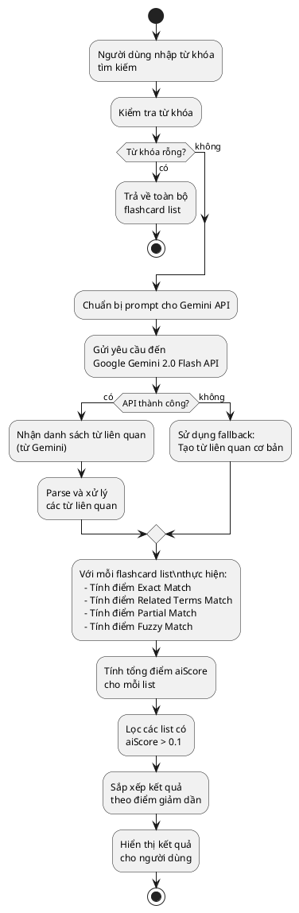
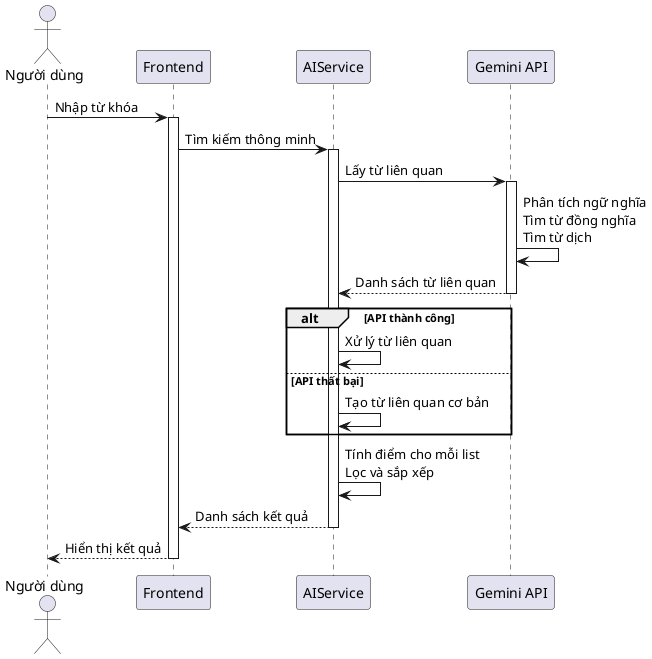

# Tìm kiếm từ vựng thông minh

## Tổng quan

Tìm kiếm từ vựng thông minh là một tính năng sử dụng Google Gemini 2.0 API để hỗ trợ người học tìm kiếm các flashcard list một cách chính xác và linh hoạt. Tính năng này không chỉ tìm kiếm dựa trên từ khóa chính xác mà còn hiểu được ngữ nghĩa, hỗ trợ tìm kiếm đa ngôn ngữ (tiếng Anh - tiếng Việt), và xử lý được các trường hợp gõ sai chính tả.

## Cách thức hoạt động

### Quy trình tổng thể

Khi người dùng nhập từ khóa tìm kiếm, hệ thống thực hiện các bước sau:

1. **Nhận prompt từ người dùng**: Người dùng nhập từ khóa tìm kiếm (có thể là tiếng Anh hoặc tiếng Việt)
2. **Gửi yêu cầu đến Gemini API**: Hệ thống gửi prompt được thiết kế đặc biệt đến Google Gemini 2.0 Flash API
3. **Gemini sinh ra các từ liên quan**: AI phân tích và trả về danh sách các từ liên quan bao gồm:
   - Từ đồng nghĩa (synonyms)
   - Từ có nghĩa tương tự (similar meaning)
   - Từ dịch tương đương giữa tiếng Việt và tiếng Anh (translation equivalents)
   - Các biến thể của từ gốc (word variations)
4. **Tìm kiếm trong flashcard list**: Hệ thống so khớp các từ liên quan với title và description của các flashcard list
5. **Tính điểm relevance (aiScore)**: Mỗi flashcard list được đánh giá điểm dựa trên mức độ khớp
6. **Lọc và sắp xếp kết quả**: Chỉ hiển thị các list có điểm số > 0.1 và sắp xếp theo điểm giảm dần

### Chi tiết các bước

#### Bước 1: Nhận prompt từ người dùng

- Người dùng nhập từ khóa tìm kiếm vào ô tìm kiếm (có thể là tiếng Anh hoặc tiếng Việt)
- Hệ thống kiểm tra và loại bỏ khoảng trắng thừa
- Nếu từ khóa rỗng, trả về toàn bộ danh sách flashcard

#### Bước 2: Gửi yêu cầu đến Gemini API

Hệ thống gửi prompt được thiết kế đặc biệt đến Google Gemini 2.0 Flash API để yêu cầu tìm các từ liên quan.

**Prompt được gửi đến Gemini:**
```
Tìm các từ/cụm từ liên quan đến "[từ khóa]" trong ngữ cảnh học tiếng Anh và flashcard.

QUAN TRỌNG: Nếu từ khóa là tiếng Việt, hãy trả về cả từ tiếng Anh tương đương và các từ liên quan.
Ví dụ: "trường học" → trả về: school, education, academy, institution, learning, university

Trả về danh sách các từ liên quan, bao gồm:
- Từ đồng nghĩa (cả tiếng Việt và tiếng Anh nếu có)
- Từ có nghĩa tương tự
- Từ dịch/tương đương giữa các ngôn ngữ
- Từ có thể liên quan trong ngữ cảnh học tập
- Các biến thể của từ gốc

Chỉ trả về danh sách các từ, mỗi từ một dòng, không cần giải thích hay số thứ tự.
```

**Cấu hình API:**
- Model: `gemini-2.0-flash-exp`
- Temperature: 0.7 (cân bằng giữa sáng tạo và chính xác)
- TopK: 40
- TopP: 0.95
- MaxOutputTokens: 200

#### Bước 3: Gemini sinh ra các từ liên quan

Gemini API phân tích từ khóa và trả về danh sách các từ liên quan. Các từ liên quan này bao gồm:

- **Từ gần nghĩa**: Các từ có nghĩa gần với từ khóa tìm kiếm
- **Từ nghĩa tương tự**: Các từ có nghĩa tương tự hoặc liên quan trong cùng ngữ cảnh    
- **Từ dịch tương đương**: 
  - Nếu từ khóa là tiếng Việt → trả về từ tiếng Anh tương đương và ngược lại
  - Ví dụ: "trường học" → "school", "education", "academy"
  - Ví dụ: "school" → "trường học", "giáo dục", "học tập"

**Ví dụ kết quả từ Gemini:**
- Input: "trường học"
- Output: 
  ```
  school
  education
  academy
  institution
  learning
  university
  học tập
  giáo dục
  ```

Sau khi nhận kết quả từ Gemini, hệ thống sẽ:
- Parse response từ Gemini API
- Tách các từ liên quan theo từng dòng
- Chuyển về chữ thường (lowercase)
- Loại bỏ từ khóa gốc khỏi danh sách (tránh trùng lặp)
- Lọc các từ rỗng

#### Bước 4: Tìm kiếm trong flashcard list

Hệ thống duyệt qua tất cả các flashcard list và kiểm tra xem title hoặc description của mỗi list có khớp với các từ liên quan mà Gemini đã sinh ra hay không.

- **Khớp với title**: Nếu title của flashcard list chứa bất kỳ từ liên quan nào
- **Khớp với description**: Nếu description của flashcard list chứa bất kỳ từ liên quan nào

Các flashcard list có title hoặc description khớp với các từ liên quan sẽ được đánh dấu để hiển thị.

#### Bước 5: Tính điểm relevance (aiScore) cho mỗi flashcard list

Để đảm bảo kết quả tìm kiếm chính xác và phù hợp nhất, hệ thống tính điểm cho mỗi flashcard list dựa trên các tiêu chí sau:

**1. Exact Match (Khớp chính xác):**
- Title khớp chính xác với từ khóa tìm kiếm: +1.0 điểm
- Description khớp chính xác với từ khóa tìm kiếm: +0.8 điểm

**2. Related Terms Match (Khớp với từ liên quan):**
- Mỗi từ liên quan (từ Gemini) khớp trong title: +0.6 điểm
- Mỗi từ liên quan (từ Gemini) khớp trong description: +0.4 điểm

**3. Partial Match (Khớp một phần):**
- Mỗi từ trong từ khóa tìm kiếm khớp trong title: +0.3 điểm
- Mỗi từ trong từ khóa tìm kiếm khớp trong description: +0.2 điểm
- Chỉ áp dụng cho từ có độ dài > 2 ký tự

**4. Fuzzy Matching (Khớp gần đúng - Levenshtein Distance):**
- Tính độ tương đồng giữa từ khóa và title/description
- Nếu similarity > 60%: +0.5 × similarity điểm
- Giúp xử lý trường hợp gõ sai chính tả

**Điểm tối đa:** 2.0 điểm (capped)

#### Bước 6: Lọc và sắp xếp kết quả

Sau khi tính điểm cho tất cả các flashcard list, hệ thống thực hiện:

- **Lọc kết quả**: Chỉ giữ lại các flashcard list có `aiScore > 0.1` để loại bỏ những kết quả không liên quan
- **Sắp xếp kết quả**: Sắp xếp các flashcard list theo điểm số giảm dần (từ cao xuống thấp), đảm bảo kết quả phù hợp nhất được hiển thị đầu tiên
- **Trả về kết quả**: Trả về danh sách các flashcard list đã được lọc và sắp xếp để hiển thị cho người dùng

#### Bước 7: Fallback mechanism (Cơ chế dự phòng)

Nếu Gemini API gặp lỗi hoặc không phản hồi:
- Hệ thống tự động chuyển sang tìm kiếm thông thường (exact match)
- Sử dụng hàm `generateBasicRelatedTerms()` để tạo một số từ liên quan cơ bản
- Đảm bảo tính năng tìm kiếm vẫn hoạt động ngay cả khi AI không khả dụng

## Sơ đồ quy trình



## Sơ đồ luồng dữ liệu chi tiết



## Ví dụ minh họa

### Ví dụ 1: Tìm kiếm bằng tiếng Việt

**Input:** "trường học"

**Gemini trả về:**
- school
- education
- academy
- institution
- learning
- university
- học tập
- giáo dục

**Flashcard Lists trong database:**
1. "School Vocabulary" - Description: "Basic words about school"
2. "Education System" - Description: "Terms related to education"
3. "Daily Life" - Description: "Common daily words"

**Kết quả sau khi tính điểm:**
1. "School Vocabulary" - aiScore: 1.6 (exact match "school" + related term "school")
2. "Education System" - aiScore: 1.2 (related term "education")
3. "Daily Life" - aiScore: 0.0 (không khớp)

**Kết quả hiển thị:** Chỉ hiển thị "School Vocabulary" và "Education System"

### Ví dụ 2: Tìm kiếm với lỗi chính tả

**Input:** "vocabulry" (sai chính tả của "vocabulary")

**Gemini trả về:**
- vocabulary
- vocab
- words
- từ vựng
- terminology

**Fuzzy Matching:** Phát hiện "vocabulry" gần giống "vocabulary" (similarity: 0.85)

**Flashcard Lists:**
1. "Vocabulary Builder" - aiScore: 1.85 (fuzzy match + related terms)
2. "English Words" - aiScore: 0.4 (related term "words")

**Kết quả:** Vẫn tìm được đúng list mong muốn dù gõ sai chính tả

## Ưu điểm của hệ thống

1. **Tìm kiếm đa ngôn ngữ**: Hỗ trợ tìm kiếm bằng cả tiếng Anh và tiếng Việt
2. **Hiểu ngữ nghĩa**: Không chỉ tìm theo từ khóa chính xác mà còn hiểu được ý nghĩa
3. **Xử lý lỗi chính tả**: Fuzzy matching giúp tìm được kết quả dù gõ sai
4. **Kết quả chính xác**: Hệ thống scoring đảm bảo kết quả phù hợp nhất được hiển thị đầu tiên
5. **Tính ổn định**: Có cơ chế fallback khi AI không khả dụng
6. **Hiệu suất cao**: Sử dụng Gemini 2.0 Flash với tốc độ xử lý nhanh

## Công nghệ sử dụng

- **Google Gemini 2.0 Flash API**: Mô hình AI đa ngôn ngữ, tốc độ cao
- **Levenshtein Distance Algorithm**: Thuật toán tính độ tương đồng chuỗi cho fuzzy matching
- **Relevance Scoring System**: Hệ thống tính điểm dựa trên nhiều tiêu chí
- **Fallback Mechanism**: Cơ chế dự phòng đảm bảo tính ổn định
k
