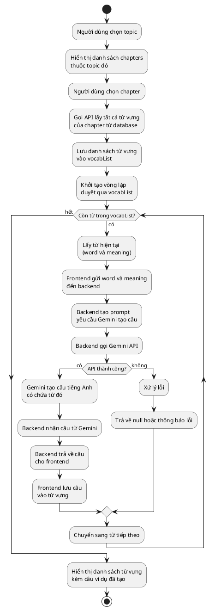
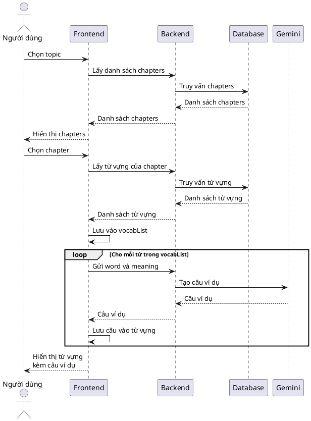

# Tạo câu ví dụ

## Tổng quan

Tạo câu ví dụ là một tính năng sử dụng Google Gemini API để tự động tạo câu tiếng Anh mẫu cho từng từ vựng trong một chapter. Hệ thống duyệt qua tất cả các từ vựng trong chapter đã chọn và tạo câu ví dụ phù hợp với ngữ cảnh và nghĩa của từ.

## Cách thức hoạt động

### Quy trình tổng thể

Khi người dùng muốn tạo câu ví dụ cho các từ vựng trong một chapter, hệ thống thực hiện các bước sau:

1. **Người dùng chọn topic**: Người dùng chọn một chủ đề (topic) từ danh sách
2. **Hiển thị danh sách chapters**: Hệ thống hiển thị tất cả các chapter thuộc topic đó
3. **Người dùng chọn chapter**: Người dùng chọn một chapter cụ thể
4. **Lấy danh sách từ vựng**: Hệ thống gọi API để lấy tất cả từ vựng của chapter từ database
5. **Lưu vào vocabList**: Danh sách từ vựng được lưu vào vocabList trong frontend
6. **Duyệt qua từng từ**: Hệ thống duyệt qua tất cả các từ trong vocabList
7. **Tạo câu cho mỗi từ**: Với mỗi từ, frontend gửi word và meaning đến backend, backend tạo prompt và gọi Gemini API để tạo câu
8. **Trả về kết quả**: Backend trả về câu ví dụ cho frontend để hiển thị

### Chi tiết các bước

#### Bước 1: Người dùng chọn topic

- Người dùng xem danh sách các topic có sẵn
- Chọn một topic muốn học
- Hệ thống lưu topicId đã chọn

#### Bước 2: Hiển thị danh sách chapters

Hệ thống gọi API để lấy danh sách chapters thuộc topic:

- **API endpoint**: `GET /api/chapters/topic/:topicId`
- **Kết quả**: Danh sách các chapter với thông tin:
  - id: ID của chapter
  - title: Tiêu đề chapter
  - description: Mô tả chapter
  - vocab_count: Số lượng từ vựng trong chapter

#### Bước 3: Người dùng chọn chapter

- Người dùng xem danh sách chapters và chọn một chapter
- Hệ thống lưu chapterId đã chọn

#### Bước 4: Lấy danh sách từ vựng từ database

Hệ thống gọi API để lấy tất cả từ vựng của chapter:

- **API endpoint**: `GET /api/chapters/:chapterId/vocabulary`
- **Truy vấn database**: 
  ```sql
  SELECT v.*, c.title as chapter_title, t.title as topic_title
  FROM vocabulary v
  LEFT JOIN chapters c ON v.chapter_id = c.id
  LEFT JOIN topic t ON v.topic_id = t.id
  WHERE v.chapter_id = $1
  ORDER BY v.id ASC
  ```
- **Kết quả**: Mảng các từ vựng với thông tin:
  - id: ID từ vựng
  - word: Từ vựng
  - meaning: Nghĩa của từ
  - phonetic: Phiên âm
  - word_type: Loại từ
  - example: Câu ví dụ hiện có (nếu có)

#### Bước 5: Lưu vào vocabList

- Danh sách từ vựng nhận được từ API được lưu vào biến `vocabList` trong frontend
- **Cấu trúc dữ liệu**: Mảng các object từ vựng
- **Thông tin lưu trữ**:
  - word: Từ vựng
  - meaning: Nghĩa của từ
  - id: ID từ vựng
  - Các thông tin khác (phonetic, word_type, ...)

#### Bước 6: Duyệt qua từng từ trong vocabList

- Hệ thống sử dụng vòng lặp để duyệt qua từng từ trong vocabList
- Với mỗi từ, thực hiện bước 7 để tạo câu ví dụ

#### Bước 7: Tạo câu cho mỗi từ

**7.1. Frontend gửi dữ liệu lên backend**

- Frontend gửi request đến backend với:
  - **API endpoint**: `POST /api/vocab/generate-sentence`
  - **Body**:
    ```json
    {
      "word": "hello",
      "meaning": "xin chào"
    }
    ```

**7.2. Backend nhận dữ liệu và validate**

- Backend kiểm tra xem word và meaning có được cung cấp không
- Nếu thiếu, trả về lỗi 400

**7.3. Backend tạo prompt cho Gemini**

- Backend tạo prompt yêu cầu Gemini tạo một câu tiếng Anh có chứa từ đó
- **Prompt mẫu**:
  ```
  Generate a natural, authentic English sentence for a fill-in-the-blank exercise.

  Requirements:
  - Use the word "hello" (meaning: "xin chào") naturally in context
  - Create a sentence that demonstrates the word's actual meaning and usage
  - Make it clear, grammatically correct, and educational
  - The sentence should be suitable for intermediate English learners
  - Make it realistic and practical (not overly simple or contrived)
  - Maximum 15 words

  Word: hello
  Meaning: xin chào

  Return ONLY the sentence, nothing else. Do not include explanations or quotes.
  ```

**7.4. Backend gọi Gemini API**

- Backend gửi prompt đến Google Gemini API
- **API endpoint**: `https://generativelanguage.googleapis.com/v1beta/models/gemini-2.0-flash-exp:generateContent?key={API_KEY}`
- **Method**: POST
- **Body**:
  ```json
  {
    "contents": [{
      "parts": [{
        "text": "{prompt}"
      }]
    }],
    "generationConfig": {
      "temperature": 0.3,
      "topK": 40,
      "topP": 0.95,
      "maxOutputTokens": 500
    }
  }
  ```

**7.5. Gemini tạo câu và trả về**

- Gemini phân tích từ và nghĩa
- Tạo một câu tiếng Anh tự nhiên có chứa từ đó
- Trả về câu ví dụ dưới dạng text

**7.6. Backend xử lý kết quả**

- Backend nhận response từ Gemini
- Trích xuất câu từ response: `data?.candidates?.[0]?.content?.parts?.[0]?.text?.trim()`
- Loại bỏ dấu ngoặc kép nếu có
- Trả về cho frontend

**7.7. Frontend nhận kết quả**

- Frontend nhận câu ví dụ từ backend
- Lưu câu vào từ vựng tương ứng trong vocabList
- Hiển thị câu cho người dùng

#### Bước 8: Hoàn tất và hiển thị

- Sau khi tạo xong câu cho tất cả các từ trong vocabList
- Frontend hiển thị danh sách từ vựng kèm câu ví dụ đã tạo
- Người dùng có thể xem và sử dụng các câu ví dụ này

## Sơ đồ quy trình



## Sơ đồ luồng dữ liệu



## Ví dụ minh họa

### Ví dụ 1: Tạo câu cho từ "hello"

**Input:**
- word: "hello"
- meaning: "xin chào"

**Prompt gửi đến Gemini:**
```
Generate a natural, authentic English sentence for a fill-in-the-blank exercise.

Requirements:
- Use the word "hello" (meaning: "xin chào") naturally in context
- Create a sentence that demonstrates the word's actual meaning and usage
- Make it clear, grammatically correct, and educational
- The sentence should be suitable for intermediate English learners
- Make it realistic and practical (not overly simple or contrived)
- Maximum 15 words

Word: hello
Meaning: xin chào

Return ONLY the sentence, nothing else. Do not include explanations or quotes.
```

**Kết quả từ Gemini:**
```
She waved and said hello to her neighbor across the street.
```

**Kết quả trả về frontend:**
```json
{
  "sentence": "She waved and said hello to her neighbor across the street."
}
```

### Ví dụ 2: Tạo câu cho từ "beautiful"

**Input:**
- word: "beautiful"
- meaning: "đẹp"

**Kết quả từ Gemini:**
```
The sunset over the ocean was incredibly beautiful tonight.
```

**Kết quả trả về frontend:**
```json
{
  "sentence": "The sunset over the ocean was incredibly beautiful tonight."
}
```

### Ví dụ 3: Tạo câu cho từ "difficult"

**Input:**
- word: "difficult"
- meaning: "khó khăn"

**Kết quả từ Gemini:**
```
Learning a new language can be difficult but very rewarding.
```

**Kết quả trả về frontend:**
```json
{
  "sentence": "Learning a new language can be difficult but very rewarding."
}
```

## Ưu điểm

1. **Tự động hóa**: Tự động tạo câu ví dụ cho tất cả từ vựng trong chapter, tiết kiệm thời gian
2. **Chất lượng cao**: Sử dụng AI để tạo câu tự nhiên, phù hợp với ngữ cảnh
3. **Nhất quán**: Tất cả câu ví dụ đều tuân theo cùng một tiêu chuẩn chất lượng
4. **Linh hoạt**: Có thể tạo lại câu ví dụ bất cứ lúc nào nếu không hài lòng
5. **Học tập hiệu quả**: Câu ví dụ giúp người học hiểu cách sử dụng từ trong ngữ cảnh thực tế

## Công nghệ sử dụng

- **Frontend**: React.js
- **Backend**: Node.js, Express.js
- **Database**: PostgreSQL
- **AI API**: Google Gemini 2.0 Flash Experimental
- **API Communication**: RESTful API

